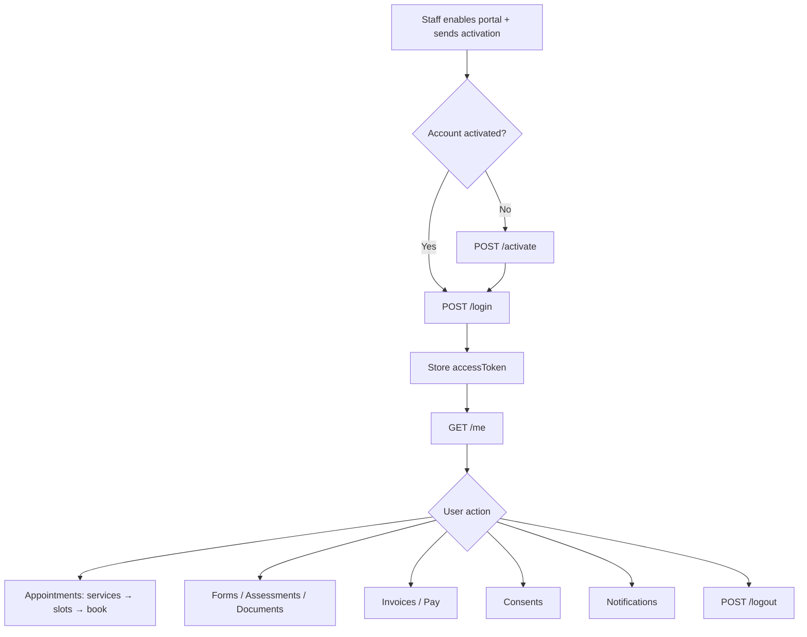

# Client Portal API — Frontend Integration Guide

Endpoints for **authenticated clients** (`ROLE_CLIENT` + `CLIENT_PORTAL_ACCESS`).  
This document does **not** cover staff client-management APIs (`/api/v1/clients`).

**Bases:**
- `/api/v1/portal`
- `/api/v1/portal/notifications`

---

## Table of Contents

1. [Auth & prerequisites](#auth--prerequisites)
2. [Recommended portal flow](#recommended-portal-flow)
3. [Endpoint index](#endpoint-index)
4. [Standard error format](#standard-error-format)
5. [Enums](#enums)
6. [Public endpoints (no token)](#public-endpoints-no-token)
7. [Authenticated endpoints](#authenticated-endpoints)
8. [What clients cannot do](#what-clients-cannot-do)

---

## Auth & prerequisites

### Who can call these APIs?

| Requirement | Details |
|-------------|---------|
| Role | `ROLE_CLIENT` in JWT |
| Permission | `CLIENT_PORTAL_ACCESS` authority |
| Account | Staff must enable portal + set portal email |
| Plan | Organisation must have `CLIENT_PORTAL` subscription feature |
| Scope | Client may only access **their own** data (sessions, documents, invoices, etc.) |

### Public vs protected

| Auth | Paths |
|------|-------|
| **No JWT** | `POST /login`, `POST /activate`, `POST /forgot-password`, `POST /reset-password` |
| **Client JWT required** | All other `/api/v1/portal/**` routes |

### Authorization header

```
Authorization: Bearer <accessToken>
```

Login and activate responses return `accessToken`, `refreshToken`, `tokenType` (`Bearer`), and `expiresIn` (seconds).

### Global blockers (any protected route)

| HTTP | Message | When |
|------|---------|------|
| `403` | `Client portal is not available on your plan...` | Org missing `CLIENT_PORTAL` feature |
| `401` | Invalid/expired token | Missing or bad JWT |
| `403` | Access denied | JWT is staff token, not client |

---

## Recommended portal flow



### Typical booking flow

```
1. POST /login
2. GET  /me                          → therapistId, timezone
3. GET  /services                    → pick serviceId
4. GET  /available-slots             → startDate, endDate, sessionType
   OR GET /therapists/{id}/availability?date=&serviceId=
5. POST /book-appointment
6. GET  /appointments                → confirm list
```

---

## Endpoint index

### `/api/v1/portal`

| # | Method | Path | Auth | Summary |
|---|--------|------|------|---------|
| 1 | `POST` | `/login` | Public | Login |
| 2 | `POST` | `/activate` | Public | Activate account |
| 3 | `POST` | `/forgot-password` | Public | Request reset email |
| 4 | `POST` | `/reset-password` | Public | Reset password |
| 5 | `GET` | `/me` | Client | Profile |
| 6 | `GET` | `/me/sessions-history` | Client | Session history (`scope=upcoming` or `past`) |
| 7 | `GET` | `/me/sessions-stats` | Client | Session dashboard stats |
| 8 | `POST` | `/me/sessions/{sessionId}/rating` | Client | Rate session |
| 9 | `POST` | `/me/upload-avatar` | Client | Upload avatar |
| 10 | `GET` | `/me/timezone` | Client | Get timezone |
| 11 | `PUT` | `/me/timezone` | Client | Set timezone |
| 12 | `POST` | `/logout` | Client | Logout / revoke tokens |
| 13 | `GET` | `/appointments` | Client | List appointments |
| 14 | `GET` | `/appointments/{id}` | Client | Appointment detail |
| 15 | `POST` | `/appointments/{id}/cancel` | Client | Cancel appointment |
| 16 | `PUT` | `/appointments/{id}/reschedule` | Client | Reschedule |
| 17 | `GET` | `/services` | Client | Bookable services |
| 18 | `GET` | `/available-slots` | Client | Open time slots |
| 19 | `POST` | `/book-appointment` | Client | Book session |
| 20 | `GET` | `/rooms/availability` | Client | Rooms for a date |
| 21 | `GET` | `/rooms/available-slot` | Client | Rooms for exact slot |
| 22 | `GET` | `/therapists/{therapistId}/availability` | Client | Therapist slots |
| 23 | `GET` | `/invoices/stats` | Client | Invoice overview totals |
| 24 | `GET` | `/invoices` | Client | Paginated invoice list |
| 25 | `GET` | `/invoices/{invoiceId}/receipt` | Client | Receipt PDF |
| 26 | `POST` | `/invoices/{invoiceId}/pay` | Client | Stripe checkout |
| 27 | `GET` | `/documents` | Client | Shared documents |
| 26 | `POST` | `/upload-document` | Client | Upload document |
| 27 | `GET` | `/documents/{id}/view` | Client | View inline |
| 28 | `GET` | `/documents/{id}/download` | Client | Download |
| 29 | `GET` | `/forms/assignments` | Client | Form assignments |
| 30 | `GET` | `/forms/assignments/{id}` | Client | Assignment detail |
| 31 | `GET` | `/forms/responses/{assignmentId}` | Client | Saved answers |
| 32 | `POST` | `/forms/responses` | Client | Save field answer |
| 33 | `GET` | `/forms/signature/{assignmentId}` | Client | Get signature |
| 34 | `POST` | `/forms/signature` | Client | Save signature |
| 35 | `POST` | `/forms/submit/{assignmentId}` | Client | Submit form |
| 36 | `GET` | `/consents` | Client | List consents |
| 37 | `POST` | `/consents` | Client | Grant/deny consent |
| 38 | `POST` | `/consents/withdraw` | Client | Withdraw consent |
| 39 | `PUT` | `/consents/toggle` | Client | Toggle consent (preferred) |
| 40 | `GET` | `/assessments` | Client | Assessment assignments |
| 41 | `GET` | `/assessments/{assignmentId}` | Client | Assignment detail |
| 42 | `POST` | `/assessments/{assignmentId}/responses` | Client | Submit answers |
| 43 | `GET` | `/notifications/legacy` | Client | **Deprecated** — use `/portal/notifications` |

### `/api/v1/portal/notifications`

| # | Method | Path | Auth | Summary |
|---|--------|------|------|---------|
| 44 | `GET` | `/` | Client | List notifications |
| 45 | `GET` | `/unread/count` | Client | Unread count (number) |
| 46 | `GET` | `/unread-count` | Client | Unread count `{count}` |
| 47 | `PATCH` | `/{id}/read` | Client | Mark one read |
| 48 | `PATCH` | `/read-all` | Client | Mark all read |
| 49 | `PUT` | `/mark-all-read` | Client | Mark all read (alt) |
| 50 | `DELETE` | `/{id}` | Client | Soft-delete notification |
| 51 | `GET` | `/preferences` | Client | Notification prefs |
| 52 | `PUT` | `/preferences/{notificationType}` | Client | Update preference |

---

## Standard error format

```json
{
  "timestamp": "2026-06-15T12:00:00Z",
  "status": 400,
  "error": "Bad Request",
  "message": "Human-readable primary message",
  "code": "GENERIC_002",
  "path": "/api/v1/portal/book-appointment",
  "traceId": "abc-123",
  "details": {
    "errors": {
      "email": "Email is required"
    }
  }
}
```

| HTTP | Typical `code` | When |
|------|----------------|------|
| `400` | `VALIDATION_001` / `GENERIC_002` | Validation, business rule |
| `401` | `AUTH_004` | Bad login, invalid token |
| `403` | `AUTH_003` | Wrong role, plan disabled, not your resource |
| `404` | `GENERIC_001` | Resource not found |

Validation errors (`@Valid`) include `details.errors` as `{ field: message }`.

---

## Enums

### `SessionType` (booking, slots, availability)

JSON values:

```json
"online" | "in-person"
```

Also accepts enum names `ONLINE`, `IN_PERSON` (case-insensitive).

### `ConsentType` (toggle + grant/withdraw)

JSON uses **display names** (case-insensitive):

| Enum | JSON value |
|------|------------|
| `TREATMENT` | `"Consent for Treatment"` |
| `TELEHEALTH` | `"Telehealth Consent"` |
| `HIPAA_PRIVACY` | `"HIPAA Privacy Notice"` |
| `HIPAA_AUTHORIZATION` | `"HIPAA Authorization"` |
| `AI_PROCESSING` | `"AI Processing Consent"` |
| `ELECTRONIC_RECORDS` | `"Electronic Health Records"` |
| `INSURANCE_SHARING` | `"Insurance Information Sharing"` |
| `PAYMENT_AUTHORIZATION` | `"Payment Authorization"` |
| `RESEARCH` | `"Research Participation"` |
| `TRAINING` | `"Training/Supervision"` |
| `DATA_SHARING` | `"Data Sharing"` |
| `MARKETING` | `"Marketing Communications"` |
| `PHOTOGRAPHY` | `"Photography Consent"` |
| `AUDIO_RECORDING` | `"Audio Recording"` |
| `VIDEO_RECORDING` | `"Video Recording"` |
| `EMAIL_COMMUNICATION` | `"Email Communication"` |
| `SMS_COMMUNICATION` | `"SMS Communication"` |
| `PARENTAL_CONSENT` | `"Parental/Guardian Consent"` |
| `EMERGENCY_CONTACT` | `"Emergency Contact Authorization"` |
| `OTHER` | `"Other"` |

**Toggle endpoint** (`PUT /consents/toggle`) accepts enum constant names in JSON body via `ConsentType` deserialization (maps to display names).

### Session / appointment status (read-only in responses)

Typical values: `scheduled`, `confirmed`, `completed`, `cancelled`, `no-show`, `in-progress`

---

## Public endpoints (no token)

### 1. `POST /api/v1/portal/login`

**Allowed:** Portal-enabled client with valid portal email + password.  
**Not allowed:** Staff users, portal disabled, wrong password, locked account.

**Request:**

```json
{
  "email": "client@example.com",
  "password": "ClientPassword123!"
}
```

| Field | Required | Validation |
|-------|----------|------------|
| `email` | Yes | Valid email |
| `password` | Yes | Non-blank |

**Response `200`:**

```json
{
  "accessToken": "eyJhbGciOiJIUzI1NiIs...",
  "refreshToken": "eyJhbGciOiJIUzI1NiIs...",
  "tokenType": "Bearer",
  "expiresIn": 86400,
  "client": {
    "id": 123,
    "clientId": "CL-2026-0045",
    "fullName": "John Doe",
    "email": "client@example.com",
    "phone": "+1-555-123-4567",
    "assignedTherapistId": 5,
    "timezone": "America/New_York",
    "avatarUrl": null
  }
}
```

**Errors:**

| HTTP | Message |
|------|---------|
| `400` | Validation (missing email/password) |
| `401` | `Invalid email or password` |
| `401` | `Account temporarily locked. Try again later.` |
| `403` | Portal plan not enabled |

---

### 2. `POST /api/v1/portal/activate`

**Allowed:** Valid activation token from email, password ≥ 8 chars, portal enabled.  
**Not allowed:** Expired/used token, portal not enabled.

**Request:**

```json
{
  "token": "activation-token-from-email",
  "password": "ClientPassword123!"
}
```

| Field | Required | Validation |
|-------|----------|------------|
| `token` | Yes | Non-blank |
| `password` | Yes | Min 8 characters (service validates) |

**Response `200`:**

```json
{
  "message": "Account activated successfully",
  "client": { "id": 123, "clientId": "CL-2026-0045", "fullName": "John Doe", "email": "client@example.com", "assignedTherapistId": 5, "timezone": null, "avatarUrl": null },
  "accessToken": "eyJ...",
  "refreshToken": "eyJ...",
  "tokenType": "Bearer",
  "expiresIn": 86400
}
```

**Errors:** `400` invalid/expired token, password too short, portal not enabled.

---

### 3. `POST /api/v1/portal/forgot-password`

**Allowed:** Always returns success (anti-enumeration).  
**Not allowed:** Missing email.

**Request:**

```json
{
  "email": "client@example.com",
  "orgSlug": "acme-clinic",
  "orgId": "42"
}
```

`orgSlug` / `orgId` optional for multi-org routing.

**Response `200`:**

```json
{
  "message": "If an account exists with this email, a password reset link has been sent."
}
```

---

### 4. `POST /api/v1/portal/reset-password`

**Request:**

```json
{
  "token": "reset-token-from-email",
  "password": "NewPassword123!"
}
```

**Response `200`:**

```json
{
  "message": "Password reset successfully. You can now log in with your new password."
}
```

**Errors:** `400` invalid/expired token, password &lt; 8 chars, portal not enabled.

---

## Authenticated endpoints

All require `Authorization: Bearer <accessToken>` unless noted.

---

### Profile & account

#### `GET /me`

**Response `200`:** `PortalClientResponse` (same shape as login `client` object).

#### `GET /me/sessions-history`

**Query parameters:**

| Param | Required | Values | Notes |
|-------|----------|--------|-------|
| `scope` | Yes | `upcoming` \| `past` | Missing or invalid → `400` |
| `timezone` | No | IANA timezone | Defaults to client profile timezone (`GET /me`); falls back to `UTC` if unset |

**Examples:**

```
GET /api/v1/portal/me/sessions-history?scope=upcoming
GET /api/v1/portal/me/sessions-history?scope=past
GET /api/v1/portal/me/sessions-history?scope=upcoming&timezone=America/New_York
```

**Classification (server-side):**

- `sessionEnd = sessionDate + duration` (default duration 60 min)
- **past:** terminal status (`completed`, `cancelled`, `no-show`) **or** `sessionEnd < now`
- **upcoming:** active status (`scheduled`, `confirmed`, `rescheduling`, `in-progress`) **and** `sessionEnd >= now`
- **Sort:** upcoming → `sessionDate` ASC; past → `sessionDate` DESC

**Response `200`:** `SessionResponse[]` (same shape as before; only filter + sort change)

**Errors:**

| HTTP | When |
|------|------|
| `400` | Invalid/missing `scope`, or invalid `timezone` |
| `401` | Invalid/expired token |
| `403` | Wrong role or portal not enabled |

```json
[
  {
    "id": 101,
    "clientId": 123,
    "clientName": "John Doe",
    "therapistId": 5,
    "therapistName": "Dr. Smith",
    "sessionDate": "2026-06-10T18:00:00Z",
    "duration": 60,
    "sessionType": "Psychotherapy",
    "sessionMode": "online",
    "status": "completed",
    "serviceId": 3,
    "serviceName": "Individual Therapy 60min",
    "roomId": null,
    "roomName": null,
    "notes": null,
    "zoomEnabled": true,
    "zoomMeetingId": "123456789",
    "zoomJoinUrl": "https://zoom.us/j/...",
    "zoomPassword": "abc123",
    "recurrenceGroupId": null,
    "createdAt": "2026-06-01T10:00:00Z",
    "updatedAt": "2026-06-10T19:00:00Z"
  }
]
```

#### `GET /me/sessions-stats`

**Query:** `timezone` (optional, IANA ID). Defaults to client profile timezone (`GET /me`); falls back to `UTC` if unset.

**Response `200`:**

```json
{
  "scope": "CLIENT",
  "clientId": 123,
  "timezone": "America/New_York",
  "totalSessions": 12,
  "todaySessions": 1,
  "thisWeekSessions": 2,
  "thisMonthSessions": 4,
  "upcomingSessions": 3,
  "completedSessions": 8,
  "cancelledSessions": 1,
  "sessionsByStatus": {
    "scheduled": 2,
    "completed": 8,
    "cancelled": 1
  },
  "startDate": null,
  "endDate": null
}
```

#### `POST /me/sessions/{sessionId}/rating`

**Request:**

```json
{
  "rating": 9,
  "comment": "Very helpful session"
}
```

| Field | Required | Rules |
|-------|----------|-------|
| `rating` | Yes | Integer `0–10` |
| `comment` | No | Free text |

**Response `200`:** `{ "message": "...", "sessionId": 101, ... }` (map from service)

**Not allowed:** Rating another client's session.

#### `POST /me/upload-avatar`

**Content-Type:** `multipart/form-data`  
**Field:** `file` (required)

**Allowed:** JPEG, PNG, GIF, WebP; max **5 MB**.  
**Not allowed:** Other MIME types, oversized files.

**Response `200`:**

```json
{
  "avatarUrl": "https://storage.example.com/avatars/client-123.jpg"
}
```

#### `GET /me/timezone`

**Response `200`:**

```json
{
  "timezone": "America/New_York"
}
```

Returns `"null"` string if unset.

#### `PUT /me/timezone`

**Request:**

```json
{
  "timezone": "Asia/Karachi"
}
```

**Allowed:** Valid IANA timezone ID.  
**Not allowed:** Blank, invalid zone.

**Response `200`:** Updated `PortalClientResponse`.

#### `POST /logout`

**Request (optional):**

```json
{
  "refreshToken": "eyJ..."
}
```

**Response `200`:**

```json
{
  "message": "Logged out successfully"
}
```

---

### Appointments

#### `GET /services`

**Response `200`:**

```json
[
  {
    "id": 3,
    "serviceCode": "90834",
    "serviceName": "Individual Therapy 60min",
    "description": "Standard psychotherapy session",
    "duration": 60,
    "baseRate": 150.00
  }
]
```

Only services marked **client-portal visible** by staff.

#### `GET /available-slots`

**Query (all required):**

| Param | Example | Rules |
|-------|---------|-------|
| `startDate` | `2026-06-15` | `yyyy-MM-dd` |
| `endDate` | `2026-06-20` | `yyyy-MM-dd` |
| `sessionType` | `online` | `online` \| `in-person` |

**Response `200`:**

```json
{
  "slotsByDate": {
    "2026-06-15": [
      { "start": "09:00", "end": "10:00" },
      { "start": "14:00", "end": "15:00" }
    ],
    "2026-06-16": []
  }
}
```

**Not allowed:** Invalid session type, no assigned therapist.

#### `GET /therapists/{therapistId}/availability`

**Query:**

| Param | Required |
|-------|----------|
| `date` | Yes (`yyyy-MM-dd`) |
| `serviceId` | Yes |
| `timezone` | No (IANA) | Defaults to client profile timezone; falls back to `UTC` if unset |
| `sessionType` | No (`online` / `in-person`) |

**Response `200`:** `TherapistAvailabilityPublicResponse` (available slots for that therapist/date).

#### `GET /rooms/availability?date=2026-06-15`

**Response `200`:** `RoomAvailabilityResponse` (public room slots for date).

#### `GET /rooms/available-slot`

**Query:** `therapistId`, `sessionDate` (ISO instant), `sessionType`, optional `serviceId`, `duration`

**Response `200`:** `RoomResponse[]` for in-person booking.

#### `POST /book-appointment`

**Request:**

```json
{
  "sessionStartUtc": "2026-06-15T18:00:00Z",
  "serviceId": 3,
  "sessionType": "online",
  "duration": 60,
  "location": "Optional for in-person"
}
```

| Field | Required | Rules |
|-------|----------|-------|
| `sessionStartUtc` | Yes | ISO 8601 UTC, must be future |
| `serviceId` | Yes | Portal-visible service |
| `sessionType` | Yes | `online` \| `in-person` |
| `duration` | No | 1–480 min; defaults to service duration |
| `location` | No | Notes for in-person |

**Allowed:**
- Future slot with therapist availability
- Online: Zoom created if therapist configured
- In-person: auto room assignment when available

**Not allowed:**
- Past datetime
- Slot no longer available
- No assigned therapist
- Online without Zoom setup (may return `400`)
- No room for in-person slot

**Response `201`:**

```json
{
  "message": "Appointment booked successfully",
  "appointment": {
    "id": 205,
    "sessionDate": "2026-06-15",
    "sessionTime": "14:00",
    "duration": 60,
    "sessionType": "Psychotherapy",
    "sessionMode": "online",
    "status": "scheduled",
    "location": "Online",
    "zoomEnabled": true,
    "zoomJoinUrl": "https://zoom.us/j/...",
    "zoomPassword": "abc123"
  }
}
```

#### `GET /appointments`

**Response `200`:** `PortalAppointmentResponse[]`

```json
[
  {
    "id": 205,
    "sessionDate": "2026-06-15",
    "sessionTime": "14:00",
    "duration": 60,
    "sessionType": "Psychotherapy",
    "sessionMode": "online",
    "status": "scheduled",
    "location": "Online",
    "roomName": null,
    "referenceNumber": "SES-205",
    "serviceCode": "90834",
    "serviceName": "Individual Therapy 60min",
    "serviceRate": 150.00,
    "therapistName": "Dr. Smith"
  }
]
```

#### `GET /appointments/{id}`

**Response `200`:** Single `PortalAppointmentResponse`.  
**Not allowed:** Another client's appointment → `403`.

#### `POST /appointments/{id}/cancel`

**Allowed:** Own appointment; status `scheduled` or `confirmed`.  
**Not allowed:** Already `cancelled` or `completed`.

**Response `200`:**

```json
{
  "message": "Appointment cancelled successfully",
  "appointmentId": 205,
  "status": "cancelled"
}
```

#### `PUT /appointments/{id}/reschedule`

**Request:**

```json
{
  "newSessionStartUtc": "2026-06-16T19:00:00Z",
  "duration": 60
}
```

| Field | Required | Rules |
|-------|----------|-------|
| `newSessionStartUtc` | Yes | ISO 8601 UTC, future |
| `duration` | No | 15–480 min |

**Not allowed:** Cancelled/completed appointments, past time, slot unavailable.

**Response `200`:**

```json
{
  "message": "Appointment rescheduled successfully",
  "appointment": {
    "id": 205,
    "sessionDate": "2026-06-16",
    "sessionTime": "15:00",
    "duration": 60,
    "sessionType": "Psychotherapy",
    "sessionMode": "online",
    "status": "scheduled",
    "location": "Online"
  }
}
```

---

### Invoices & payments

#### `GET /invoices/stats`

Unfiltered totals for the logged-in client (overview cards). Not affected by list filters.

**Response `200`:**

```json
{
  "totalInvoices": 12,
  "totalBilled": 1800.00,
  "totalPaid": 1350.00
}
```

#### `GET /invoices`

Paginated, filterable invoice list.

**Query parameters:**

| Param | Required | Notes |
|-------|----------|-------|
| `page` | No | Default `1` (1-based) |
| `pageSize` | No | Default `20`, max `100` |
| `paymentStatus` | No | `unpaid`, `paid`, `partial`, `denied`, `cancelled` |
| `insuranceCovered` | No | `true` / `false` |
| `startDate` | No | `yyyy-MM-dd` on `billingDate` |
| `endDate` | No | `yyyy-MM-dd` on `billingDate` |
| `search` | No | Matches `serviceCode` or `serviceName` |

**Response `200`:** `PaginatedResponse<PortalInvoiceResponse>`

```json
{
  "items": [
    {
      "id": 50,
      "sessionId": 205,
      "serviceCode": "90834",
      "serviceName": "Individual Therapy 60min",
      "sessionType": "Psychotherapy",
      "sessionMode": "online",
      "sessionDate": "2026-06-15T18:00:00Z",
      "units": 1,
      "ratePerUnit": 150.00,
      "totalAmount": 150.00,
      "insuranceCovered": false,
      "copayAmount": 25.00,
      "billingDate": "2026-06-15",
      "billingStatus": "billed",
      "paymentStatus": "unpaid",
      "paymentAmount": null,
      "outstandingAmount": 150.00,
      "paymentDate": null,
      "paymentMethod": null,
      "discountType": null,
      "discountValue": null,
      "discountAmount": null,
      "createdAt": "2026-06-15T18:30:00Z"
    }
  ],
  "totalCount": 12,
  "page": 1,
  "pageSize": 20,
  "totalPages": 1
}
```

**`paymentStatus` values:** `unpaid`, `paid`, `partial`, `denied`, `cancelled`  
**`billingStatus` values:** `pending`, `billed`, `paid`, `denied`, `follow_up`, `cancelled`  
**`totalAmount`:** final amount after discount.

#### `GET /invoices/{invoiceId}/receipt`

Download receipt PDF for **paid** or **partial** invoices only.

**Response `200`:** `application/pdf` attachment.

**Errors:** `400` if unpaid; `404` if not client's invoice.

#### `POST /invoices/{invoiceId}/pay`

**Response `200`:**

```json
{
  "sessionId": "205",
  "checkoutUrl": "https://checkout.stripe.com/c/pay/..."
}
```

Redirect client to `checkoutUrl` for Stripe payment.

---

### Documents

#### `GET /documents`

**Response `200`:** `DocumentResponse[]` — only documents **shared with client** by staff.

#### `POST /upload-document`

**Content-Type:** `multipart/form-data`

| Field | Required |
|-------|----------|
| `file` | Yes |
| `documentType` | No (e.g. `insurance_card`, `id_document`) |

**Allowed:** Max **50 MB** per file.  
**Response `201`:** `DocumentResponse`

#### `GET /documents/{id}/view` | `GET /documents/{id}/download`

**Response:** Binary stream with appropriate `Content-Type`.  
**Not allowed:** Documents not shared with this client → `403`/`404`.

---

### Forms

#### `GET /forms/assignments`

**Response `200`:** `FormAssignmentResponse[]`

#### `GET /forms/assignments/{id}`

**Response `200`:** `Map` with assignment + template fields.

#### `GET /forms/responses/{assignmentId}`

**Response `200`:** `FormResponseDto[]`

#### `POST /forms/responses`

**Request:**

```json
{
  "assignmentId": 10,
  "assignmentFieldId": 55,
  "value": "My answer"
}
```

| Field | Required | Notes |
|-------|----------|-------|
| `assignmentId` | Yes | |
| `assignmentFieldId` | Yes | `fieldId` is **deprecated** — rejected |
| `value` | No | String answer |

**Response `200`:** `FormResponseDto`

#### `POST /forms/signature`

**Request:**

```json
{
  "assignmentId": 10,
  "signatureData": "data:image/png;base64,..."
}
```

#### `POST /forms/submit/{assignmentId}`

**Response `200`:** `FormAssignmentResponse` (status updated to submitted).

---

### Consents

#### `GET /consents`

**Response `200`:** `PortalConsentResponse[]`

```json
[
  {
    "id": 1,
    "clientId": 123,
    "consentType": "AI Processing Consent",
    "consentVersion": "1.0",
    "granted": true,
    "grantedAt": "2026-06-01T10:00:00Z",
    "withdrawnAt": null,
    "ipAddress": "192.168.1.1",
    "userAgent": "Mozilla/5.0...",
    "notes": "Consent granted via client portal",
    "createdAt": "2026-06-01T10:00:00Z",
    "updatedAt": "2026-06-01T10:00:00Z"
  }
]
```

#### `PUT /consents/toggle` (preferred)

**Request:**

```json
{
  "consentType": "AI_PROCESSING",
  "granted": true,
  "consentVersion": "1.0"
}
```

`consentType`: any `ConsentType` enum name or display name.  
`consentVersion`: optional, defaults to `"1.0"`.

#### `POST /consents`

**Request:**

```json
{
  "consentType": "Consent for Treatment",
  "granted": true,
  "consentVersion": "1.0"
}
```

`consentType` must match a **ConsentType display name** (see [Enums](#enums)).

#### `POST /consents/withdraw`

**Request:**

```json
{
  "consentType": "Consent for Treatment"
}
```

---

### Assessments

#### `GET /assessments`

**Response `200`:** `AssessmentAssignmentResponse[]`

#### `GET /assessments/{assignmentId}`

**Response `200`:** Single assignment (must belong to logged-in client).

#### `POST /assessments/{assignmentId}/responses`

**Request:**

```json
{
  "assignmentId": 7,
  "responses": [
    {
      "questionId": 101,
      "responseText": "Often",
      "selectedOptionIds": [3],
      "ratingValue": null,
      "scoreValue": null,
      "selectedOptionId": null
    }
  ]
}
```

`assignmentId` in URL overrides body.  
**Response `200`:** Updated `AssessmentAssignmentResponse`.

---

### Notifications (`/api/v1/portal/notifications`)

#### `GET /?unreadOnly=true`

**Response `200`:** `NotificationResponse[]`

```json
[
  {
    "id": 1,
    "userId": null,
    "clientId": 123,
    "type": "APPOINTMENT_REMINDER",
    "category": "APPOINTMENT",
    "title": "Upcoming appointment",
    "message": "You have a session tomorrow at 2:00 PM",
    "data": "{}",
    "priority": "NORMAL",
    "isRead": false,
    "readAt": null,
    "actionUrl": "/portal/appointments/205",
    "actionLabel": "View",
    "relatedEntityType": "session",
    "relatedEntityId": 205,
    "expiresAt": null,
    "createdAt": "2026-06-14T10:00:00Z"
  }
]
```

#### `GET /unread/count` → `200` number e.g. `5`  
#### `GET /unread-count` → `200` `{ "count": 5 }`

#### `PATCH /{id}/read` → `200` empty body  
#### `PATCH /read-all` | `PUT /mark-all-read` → `200`

#### `DELETE /{id}` → `200` `{ "success": true }`

#### `GET /preferences`

**Response `200`:** `NotificationPreferenceResponse[]`

#### `PUT /preferences/{notificationType}`

**Request:**

```json
{
  "notificationType": "APPOINTMENT_REMINDER",
  "emailEnabled": true,
  "smsEnabled": false,
  "pushEnabled": false,
  "inAppEnabled": true,
  "timing": "IMMEDIATE",
  "quietHoursStart": null,
  "quietHoursEnd": null,
  "weekendsEnabled": true
}
```

**Not allowed:** Disabling `inAppEnabled` (required for portal).

**Response `200`:** `NotificationPreferenceResponse`

---

## What clients cannot do

| Action | Why |
|--------|-----|
| Access `/api/v1/clients/**` | Staff-only client management |
| View other clients' data | Scoped to own `clientId` from JWT |
| Book without assigned therapist | `400 No therapist assigned` |
| Cancel/reschedule completed sessions | Business rule |
| Book past times | `400 Cannot book... past` |
| Use staff JWT on portal routes | `403` — needs `CLIENT_PORTAL_ACCESS` |
| Access portal when plan feature off | `403` plan message |
| Upload avatar &gt; 5 MB or non-image | `400` |
| Upload document &gt; 50 MB | `400` |
| Use deprecated `fieldId` in form responses | `400` — use `assignmentFieldId` |
| Call `GET /notifications/legacy` in new apps | Use `/portal/notifications` instead |

---

## Source files

| Area | File |
|------|------|
| Portal controller | `client/portal/controller/ClientPortalController.java` |
| Notifications | `notification/controller/ClientPortalNotificationController.java` |
| Business logic | `client/portal/service/ClientPortalService.java` |
| Security | `common/config/SecurityConfig.java` |
| DTOs | `client/portal/dto/*` |
