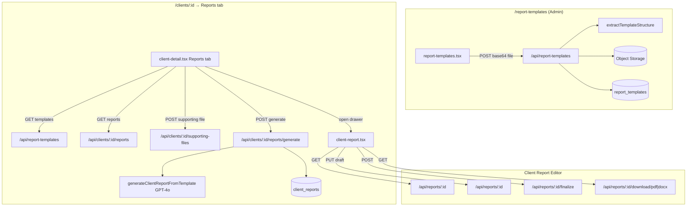

# AI Client Report Templates — Technical Handoff & Rebuild Document

> Feature: Admins upload **Word/PDF report templates**; therapists generate **AI-filled client reports** from a client's profile, sessions, notes, assessments, and optional supporting files; review in a rich-text editor; finalize; export PDF/DOCX.
>
> **Target stack for new project:** React frontend + Java (Spring Boot) backend + PostgreSQL + object storage (Azure Blob in source) + OpenAI GPT-4o.

---

## 1. Feature Overview

| Area | Who | Route / location |
|------|-----|------------------|
| Manage templates | **Admin only** | `/report-templates` |
| Generate & review reports | Therapist / Admin (with client access) | `/clients/:id` → **Reports** tab |
| Edit single report | Same | Drawer or `/clients/:clientId/reports/:reportId` |

**Core idea:** Upload a blank report layout (`.docx` or `.pdf`). Server extracts **structure text** (headings/sections). When generating, GPT-4o mimics that outline and fills sections with **real client data only** — no invention. Output is **HTML** for ReactQuill editing.

**Separate from assessment reports:** The **Assessments** tab has its own AI assessment reports (`assessment_reports`). This module is **client reports** (`client_reports` + `report_templates`).

---

## 2. Architecture



---

## 3. Database Model

### 3.1 `report_templates`

| Column | Type | Purpose |
|--------|------|---------|
| `id` | serial PK | |
| `name` | varchar(255) | Display name |
| `description` | text | Optional admin notes |
| `ai_instructions` | text | Extra AI tone/structure guidance |
| `original_name` | varchar(500) | Uploaded filename |
| `mime_type` | varchar(150) | |
| `file_size` | integer | Bytes |
| `file_blob_name` | varchar(1000) | Object storage key |
| `file_url` | text | Storage URL (not exposed to therapists for supporting files pattern) |
| `structure_text` | text | Extracted outline from doc — **fed to AI** |
| `default_include_profile` | boolean | Default ON |
| `default_include_notes` | boolean | Sessions + session notes |
| `default_include_assessments` | boolean | Assessment assignments |
| `supporting_files_guidance` | text | Shown to therapist on generate screen |
| `supporting_files_expected` | boolean | Show amber nudge if no files |
| `supporting_file_types` | text[] | Admin-defined labels for uploads |
| `is_active` | boolean | Inactive hidden from staff list |
| `created_by_id` | FK users | |
| `created_at`, `updated_at` | timestamp | |

### 3.2 `report_supporting_files` (per client)

| Column | Type | Purpose |
|--------|------|---------|
| `id` | serial PK | |
| `client_id` | FK clients | CASCADE delete |
| `original_name`, `mime_type`, `file_size` | | File metadata |
| `file_blob_name`, `file_url` | | Original file in storage |
| `document_type` | varchar(150) | From template's allowed list |
| `extracted_text` | text | **Sent to AI** — never in list API |
| `created_by_id` | FK users | |
| `created_at` | timestamp | |

### 3.3 `client_reports`

| Column | Type | Purpose |
|--------|------|---------|
| `id` | serial PK | |
| `client_id` | FK clients | |
| `template_id` | FK report_templates | SET NULL on template delete |
| `template_name` | varchar(255) | Snapshot at generation time |
| `generated_content` | text | AI output (HTML) |
| `draft_content` | text | Therapist edits |
| `final_content` | text | Locked on finalize |
| `is_draft` | boolean | default true |
| `is_finalized` | boolean | default false |
| `generated_at`, `edited_at`, `finalized_at` | timestamp | |
| `created_by_id`, `finalized_by_id` | FK users | |

**Content precedence in editor:** `finalContent` → `draftContent` → `generatedContent`

---

## 4. Access Control

| Action | Admin | Therapist | Accountant |
|--------|-------|-----------|------------|
| `/report-templates` page | ✅ | ❌ | ❌ |
| POST/PATCH/DELETE templates | ✅ | ❌ | ❌ |
| GET templates (active) | ✅ | ✅ | ❌ |
| GET templates `?includeInactive=true` | ✅ | ❌ | ❌ |
| Client Reports tab | ✅* | ✅* | ❌ |
| Generate report | ✅* | ✅* | ❌ |
| AI consent required | Yes — client `ai_processing` consent | | |

\* Must pass `userCanAccessClient` for that client.

---

## 5. API Reference (contract for React)

**Middleware:** `requireAuth` + `blockAccountant` on all routes below unless noted.

**JSON:** camelCase (`structureText`, `defaultIncludeProfile`, `templateId`, etc.)

### 5.1 Report templates

#### `GET /api/report-templates`

| Query | Behavior |
|-------|----------|
| (none) | Active templates only |
| `includeInactive=true` | All templates — **admin only** |

**Response:** `ReportTemplate[]`

Staff Reports tab uses active-only (no query param). Admin page uses `includeInactive=true`.

#### `POST /api/report-templates` (admin only)

**Request:**
```json
{
  "name": "Initial Clinical Assessment Report",
  "description": "Optional",
  "aiInstructions": "Optional tone guidance",
  "fileContent": "<base64>",
  "originalName": "template.docx",
  "mimeType": "application/vnd.openxmlformats-officedocument.wordprocessingml.document",
  "defaultIncludeProfile": true,
  "defaultIncludeNotes": true,
  "defaultIncludeAssessments": true,
  "supportingFilesGuidance": "Attach GP referral if available",
  "supportingFilesExpected": true,
  "supportingFileTypes": ["Intake form", "GP letter", "Previous report"]
}
```

**Validation:**
- Required: `name`, `fileContent`, `originalName`, `mimeType`
- Allowed types: `.docx`, `.pdf` only
- Max size: **15 MB**
- Extract `structureText` from file (mammoth for docx, pdfjs for pdf)
- Reject empty/image-only extraction → 400
- Upload original to object storage; rollback DB row if blob fails

**Response:** `201` + full `ReportTemplate`

**Audit:** `report_template_created`

#### `PATCH /api/report-templates/:id` (admin only)

Metadata only — **does not replace uploaded file**.

**Body (all optional):**
```json
{
  "name": "...",
  "description": "...",
  "aiInstructions": "...",
  "structureText": "...",
  "isActive": true,
  "defaultIncludeProfile": true,
  "defaultIncludeNotes": true,
  "defaultIncludeAssessments": true,
  "supportingFilesGuidance": "...",
  "supportingFilesExpected": false,
  "supportingFileTypes": ["Intake form"]
}
```

#### `DELETE /api/report-templates/:id` (admin only)

Deletes DB row + best-effort blob delete. **Audit:** `report_template_deleted`

---

### 5.2 Supporting files (per client)

#### `GET /api/clients/:clientId/supporting-files`

**Response** — metadata only (no `extractedText`, no blob URL):
```json
[
  {
    "id": 1,
    "clientId": 42,
    "originalName": "referral.pdf",
    "mimeType": "application/pdf",
    "fileSize": 12000,
    "documentType": "GP letter",
    "createdById": 6,
    "createdAt": "..."
  }
]
```

#### `POST /api/clients/:clientId/supporting-files`

**Request:**
```json
{
  "fileContent": "<base64>",
  "originalName": "referral.pdf",
  "mimeType": "application/pdf",
  "documentType": "GP letter",
  "templateId": 3
}
```

**Validation:**
- Types: `.docx`, `.pdf`, `.txt`
- Max 15 MB
- If `documentType` set → `templateId` required; type must be in `template.supportingFileTypes`
- Extract text → store in `extracted_text`
- Blob upload best-effort (row kept if blob fails)

**Response:** `201` + safe metadata (no extracted text)

#### `GET /api/supporting-files/:id/download`

Stream file through server after client access check (never expose raw blob URL).

#### `DELETE /api/supporting-files/:id`

Hard delete row + best-effort blob delete. **Audit:** `report_supporting_file_deleted`

---

### 5.3 Client reports

#### `GET /api/clients/:clientId/reports`

List reports for client. **Response:** `ClientReport[]` with optional `createdBy`, `template`.

#### `POST /api/clients/:clientId/reports/generate`

**Request:**
```json
{
  "templateId": 3,
  "sources": {
    "includeProfile": true,
    "includeNotes": true,
    "includeAssessments": false
  },
  "supportingFileIds": [1, 5]
}
```

**Pre-checks (order matters):**
1. `templateId` required
2. OpenAI API key configured → else `503`
3. Client exists + `userCanAccessClient`
4. Template exists + `isActive`
5. **`checkAIProcessingConsent(clientId)`** → if fail: `403` + `consentRequired: true` + audit `ai_processing_blocked`

**Data gathering:**
```java
includeProfile = sources.includeProfile ?? template.defaultIncludeProfile ?? true
includeNotes   = sources.includeNotes   ?? template.defaultIncludeNotes   ?? true
includeAssessments = sources.includeAssessments ?? template.defaultIncludeAssessments ?? true

if (includeNotes)   → sessions + sessionNotes for client
if (includeAssessments) → assessmentAssignments for client
supportingFileIds → filter client's files; only those with extractedText
```

**AI call:** `generateClientReportFromTemplate(...)` → HTML string  
**Sanitize:** DOMPurify HTML profile  
**Insert `client_reports`:**
```json
{
  "clientId": 42,
  "templateId": 3,
  "templateName": "Initial Assessment",
  "generatedContent": "<h2>...</h2><p>...</p>",
  "draftContent": null,
  "finalContent": null,
  "isDraft": true,
  "isFinalized": false,
  "generatedAt": "now",
  "createdById": "<auth user>"
}
```

**Response:** `201` + report row  
**Audit:** `client_report_generated` (HIPAA, high risk)

**Errors:** `504` timeout, `402` quota, `503` API key

#### `GET /api/reports/:id`

Single report with `client`, `createdBy`, `template` joins.

#### `PUT /api/reports/:id`

**Request:** `{ "draftContent": "<html>" }`  
- Block if `isFinalized` → 400  
- Sanitize HTML  
- Set `draftContent`, `isDraft: true`, `editedAt: now`

#### `POST /api/reports/:id/finalize`

- `finalContent = draftContent || generatedContent`
- `isFinalized: true`, `isDraft: false`, `finalizedAt`, `finalizedById`
- **Audit:** `client_report_finalized`

#### `POST /api/reports/:id/unfinalize`

- `draftContent = finalContent || draftContent || generatedContent`
- Clear `finalContent`, `finalizedAt`, `finalizedById`
- `isFinalized: false`, `isDraft: true`
- **Audit:** `client_report_reopened`

#### `DELETE /api/reports/:id`

Hard delete report row (client access required).

#### `GET /api/reports/:id/download/pdf`

Generate PDF from HTML + practice letterhead settings; fallback to print HTML. **Audit:** document download.

#### `GET /api/reports/:id/download/docx`

Generate Word document via `generateClientReportDocx`. **Audit:** document download.

---

## 6. Template Upload Flow (`/report-templates`)

**File:** `client/src/pages/report-templates.tsx`

### Step-by-step

1. Admin opens **Administration → Report Templates**
2. Clicks **Upload Template**
3. Fills:
   - Template name *
   - Description
   - AI instructions
   - File * (`.docx` or `.pdf`)
   - Default data toggles (profile, sessions/notes, assessments)
   - Supporting files guidance + expected toggle
   - Document types (one per line)
4. Frontend reads file as **base64** (`readFileAsBase64`)
5. `POST /api/report-templates`
6. Server extracts structure, stores blob, returns template
7. Card grid shows templates with Active switch, Edit, Delete

### Edit dialog (no re-upload)

Admin can edit name, description, AI instructions, **structure text manually**, defaults, supporting file config. `PATCH /api/report-templates/:id`

### Toggle active

`PATCH { isActive: true|false }` — inactive templates hidden from therapist dropdown.

---

## 7. Text Extraction (`server/report-templates/extract.ts`)

Port to Java as a dedicated service.

| Format | Library (Node) | Java suggestion |
|--------|----------------|-----------------|
| `.docx` | mammoth raw text | Apache POI / docx4j |
| `.pdf` | pdfjs-dist | Apache PDFBox |
| `.txt` | UTF-8 read | Standard |

**`extractTemplateStructure`:** normalize whitespace, cap **30,000 chars**, throw if empty.

**`extractDocumentText`:** same for supporting files (+ `.txt`).

**`isSupportedDocumentType`:** docx, pdf, txt only.

---

## 8. AI Generation (`generateClientReportFromTemplate`)

**Model:** `gpt-4o`, `temperature: 0.2`, `max_tokens: 4000`

### Input assembly

| Block | Source | When included |
|-------|--------|---------------|
| Template outline | `template.structureText` (max 12k chars) | Always |
| Admin instructions | `template.aiInstructions` (max 4k) | If set |
| Client profile | name, DOB, contact, presenting concerns | `includeProfile` |
| Session statistics | Server-computed psychotherapy count/dates | `includeNotes` |
| Session list | Up to 40 sessions with count tags | `includeNotes` |
| Session notes | Up to 20 notes; prefers finalized → draft → generated → structured fields | `includeNotes` |
| Assessments | Up to 20 assignments | `includeAssessments` |
| Supporting docs | Extracted text, labeled by `documentType` | Selected file IDs |

### Psychotherapy session counting (server-side only)

AI must **not** count sessions itself. Server computes:
- Completed status
- Not future-dated
- Service code matches psychotherapy pattern: `^(psy|ifh-[0-9]|fam|cou|ink)` or `MVA`

### Safety rules (system prompt)

- Use **only** provided data
- No invention of diagnoses, dates, scores
- Empty section → `"Information not available."`
- Output **HTML**: `<h2>`, `<h3>`, `<p>`, `<strong>`, `<ul>/<li>`
- No inline styles, no markdown fences
- Do not duplicate client header block (app renders separately on PDF)

### Output

HTML string → stored in `generated_content` → shown in ReactQuill.

---

## 9. Client Reports Tab (`/clients/:id?tab=reports`)

**File:** `client/src/pages/client-detail.tsx` (Reports `TabsContent`)

### Queries (enabled when `activeTab === 'reports'`)

| Query key | Endpoint |
|-----------|----------|
| `["/api/report-templates"]` | Active templates |
| ``[`/api/clients/${clientId}/reports`]`` | Client's reports |
| ``[`/api/clients/${clientId}/supporting-files`]`` | Supporting files list |

### Generate UI flow

1. Select **Template** dropdown → loads defaults into three switches
2. If template has `supportingFilesGuidance` → blue info box
3. If `supportingFilesExpected` and no files → amber warning
4. **Include in this report** switches:
   - Client profile
   - Sessions & session notes
   - Assessments
5. **Supporting files** section:
   - Checkbox per file to include in this generation
   - Upload new file (docx/pdf/txt)
   - Document type dropdown from `template.supportingFileTypes`
   - Download / delete per file
6. **Generate report** → `POST .../reports/generate`
7. On success → opens **wide drawer** with `ClientReportPage`

### Generated reports list

Each row: template name, Draft/Finalized badge, generated date, **Review & Edit** / **View**, Delete.

---

## 10. Report Editor (`client-report.tsx`)

Can run as:
- Route: `/clients/:clientId/reports/:reportId`
- Embedded in drawer from client detail

### Load

`GET /api/reports/:id` → set editor to `finalContent || draftContent || generatedContent`

### Draft mode (not finalized)

- **ReactQuill** WYSIWYG editor
- **Save Draft** → `PUT /api/reports/:id` `{ draftContent }`
- **Save & Finalize** → save draft then confirm dialog → `POST .../finalize`

### Finalized mode

- Read-only HTML (`dangerouslySetInnerHTML`)
- **Reopen** → `POST .../unfinalize`
- **Download PDF** / **Download Word** from actions menu

---

## 11. Frontend File Index

| Purpose | Path |
|---------|------|
| Admin templates page | `client/src/pages/report-templates.tsx` |
| Client reports tab | `client/src/pages/client-detail.tsx` (Reports `TabsContent`) |
| Report editor | `client/src/pages/client-report.tsx` |
| Routing | `client/src/App.tsx` |
| API client | `client/src/lib/queryClient.ts` |

---

## 12. Backend File Index (ClientHubAI reference)

| Purpose | Path |
|---------|------|
| Routes | `server/routes.ts` (~11317–12250) |
| Text extraction | `server/report-templates/extract.ts` |
| AI generation | `server/ai/openai.ts` (`generateClientReportFromTemplate`) |
| PDF export | `server/pdf/client-report-pdf.ts` |
| DOCX export | `server/docx/report-docx.ts` |
| Storage | `server/storage.ts` (~5028–5150) |
| Schema | `shared/schema.ts` (~1017–1094) |
| Tests | `test/client-report-*.test.ts` |

---

## 13. Java Backend — Suggested Structure

```
com.yourapp.reports
├── controller/
│   ├── ReportTemplateController.java      // /api/report-templates
│   ├── ReportSupportingFileController.java // /api/clients/:id/supporting-files, /api/supporting-files/:id
│   └── ClientReportController.java         // /api/clients/:id/reports, /api/reports/:id
├── service/
│   ├── ReportTemplateService.java
│   ├── DocumentExtractionService.java      // port extract.ts
│   ├── ClientReportGenerationService.java  // orchestrate data + AI
│   ├── ClientReportExportService.java      // PDF/DOCX
│   └── BlobStorageService.java             // Azure/S3
├── client/
│   └── OpenAiReportClient.java             // GPT-4o call
├── entity/
│   ├── ReportTemplateEntity.java
│   ├── ReportSupportingFileEntity.java
│   └── ClientReportEntity.java
└── dto/
    ├── ReportTemplateUploadRequest.java
    ├── GenerateReportRequest.java
    └── ...
```

### Java checks mirroring Node behavior

```
[ ] POST template: base64 decode, 15MB limit, docx/pdf only
[ ] structureText extracted and non-empty
[ ] Blob stored; DB rolled back on blob failure (templates)
[ ] GET supporting-files: NEVER return extractedText or raw blob URL
[ ] POST supporting-files: documentType validated against template.supportingFileTypes
[ ] POST generate: AI consent check fail-closed → 403
[ ] POST generate: inactive template → 400
[ ] Psychotherapy session stats computed server-side (don't rely on AI counting)
[ ] generated HTML sanitized before save
[ ] PUT report blocked when finalized
[ ] Finalize copies draftContent || generatedContent → finalContent
[ ] camelCase JSON throughout
[ ] Audit logs for template CRUD, generate, finalize, reopen, file upload/delete, downloads
```

---

## 14. Rebuild Checklist

### Phase 1 — DB & admin templates
- [ ] Migrations: `report_templates`, `report_supporting_files`, `client_reports`
- [ ] Object storage integration
- [ ] Document extraction service (docx, pdf, txt)
- [ ] Template CRUD APIs + admin role guard
- [ ] React `/report-templates` page

### Phase 2 — Supporting files
- [ ] List/upload/download/delete supporting file APIs
- [ ] Document type validation against template
- [ ] Reports tab upload UI

### Phase 3 — AI generation
- [ ] AI consent gate (`checkAIProcessingConsent`)
- [ ] Data aggregation (profile, sessions, notes, assessments)
- [ ] GPT-4o prompt port (structure mimic + safety rules)
- [ ] `POST .../reports/generate` + audit

### Phase 4 — Editor & export
- [ ] `client-report.tsx` with ReactQuill
- [ ] Draft save, finalize, unfinalize
- [ ] PDF + DOCX download endpoints
- [ ] Reports list on client detail

### Phase 5 — Verify
- [ ] Upload docx template → structureText populated
- [ ] Generate without consent → 403
- [ ] Generate with sources toggles → correct data in prompt
- [ ] Supporting files included in AI context when checked
- [ ] Draft edit → finalize → locked → reopen → edit again
- [ ] PDF/DOCX download with audit log

---

## 15. AI Agent Rebuild Prompt

```
Build an AI Client Report module for a therapy CRM (React + Java Spring Boot + PostgreSQL + object storage + OpenAI GPT-4o).

ADMIN (/report-templates, admin only):
- Upload Word (.docx) or PDF template (base64, max 15MB)
- Extract structureText (headings/outline, max 30k chars) — mammoth/pdfjs equivalent in Java
- Store original in blob storage; metadata in report_templates
- Configure default data sources (profile, sessions+notes, assessments)
- Configure supporting file guidance, expected flag, document type list
- PATCH metadata / toggle isActive / DELETE

CLIENT REPORTS (/clients/:id Reports tab):
- List active templates, client's reports, client's supporting files
- Upload supporting files (docx/pdf/txt, max 15MB, extract text, validate documentType against template list)
- Generate: POST /api/clients/:clientId/reports/generate
  { templateId, sources: { includeProfile, includeNotes, includeAssessments }, supportingFileIds: [] }
- Require AI processing consent on client (403 fail-closed)
- GPT-4o mimics template structureText, fills with real client data only, outputs HTML
- Save client_reports with generatedContent, isDraft true

EDITOR (client-report page):
- ReactQuill edit draftContent; PUT /api/reports/:id
- Finalize: POST /api/reports/:id/finalize (finalContent = draft || generated)
- Unfinalize, delete, download PDF/DOCX

SECURITY: block accountant; userCanAccessClient on all client-scoped ops; never expose extractedText in list APIs; sanitize HTML on save; HIPAA audit on generate/finalize/files/downloads.

Match camelCase JSON field names exactly for React compatibility.
```

---

*Last verified against ClientHubAI codebase: June 2026*
