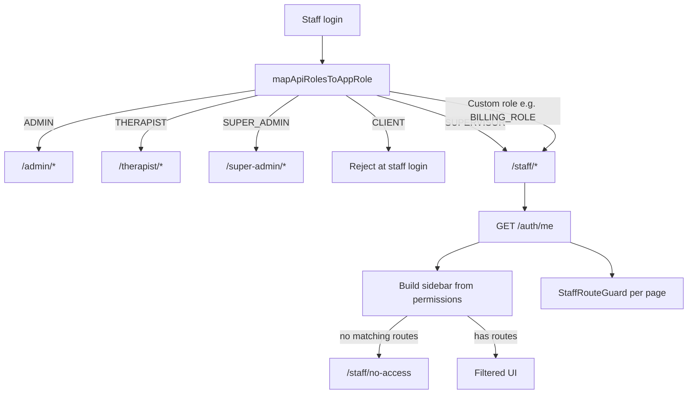

# Custom Staff Authorization — Frontend Plan & Backend Alignment Guide

Reference for how the TherapyFlow **frontend** handles **tenant custom roles** (e.g. `BILLING_ROLE`, `INTAKE_CLERK`) and what the **backend** must provide so UI and API authorization stay consistent.

**Base URL:** `/api/v1`  
**Auth:** `Authorization: Bearer <JWT>` (staff token from tenant staff login)  
**Primary profile endpoint:** `GET /api/v1/auth/me`  
**Staff login:** `POST /api/v1/auth/staff/login` (resolve-tenant flow)

**Related docs:** [Supervisor API](./supervisor-api.md) · [Notifications API](./notifications-api.md)

---

## Table of Contents

1. [Summary](#summary)
2. [Portal architecture](#portal-architecture)
3. [Role classification](#role-classification)
4. [Login & routing flow](#login--routing-flow)
5. [How the frontend reads permissions](#how-the-frontend-reads-permissions)
6. [Staff portal menu → permission mapping](#staff-portal-menu--permission-mapping)
7. [Action-level UI gating (capabilities)](#action-level-ui-gating-capabilities)
8. [API calls the staff portal makes](#api-calls-the-staff-portal-makes)
9. [Backend requirements](#backend-requirements)
10. [Known mismatch: BILLING_ROLE example](#known-mismatch-billing_role-example)
11. [Test matrix](#test-matrix)
12. [Frontend source files](#frontend-source-files)

---

## Summary

We introduced a **separate staff portal** at `/staff/*` for:

- **Supervisor** (`SUPERVISOR`) — existing clinical oversight role; role-based capability blocks
- **Custom tenant roles** — any role name created in Admin → Role Management that is **not** a fixed portal role

Custom-role users:

1. Sign in via **staff login** (`/auth/staff/login`)
2. Are mapped to app role `staff` (not `admin` / `therapist`)
3. Land in the **staff portal** (`/staff/*`), same shell supervisor uses
4. See **only menu items** whose required permissions appear in `/me` `permissions` (or `authorities`)
5. Are **blocked at the route level** from deep-linking to pages they cannot access
6. See `/staff/no-access` if they have **zero** permissions that match any staff menu route

**Fixed roles are unchanged** — they never use permission-filtered custom staff logic:

| API `roles` | Frontend portal | Path prefix |
|-------------|-----------------|-------------|
| `SUPER_ADMIN`, `PLATFORM_SUPER_ADMIN` | Platform owner | `/super-admin/*` |
| `ADMIN` | Tenant admin | `/admin/*` |
| `THERAPIST` | Therapist | `/therapist/*` |
| `CLIENT` | Client (rejected at staff login) | `/user/*` |
| `SUPERVISOR` | Staff (supervisor model) | `/staff/*` |
| **Any other role name** (e.g. `BILLING_ROLE`) | Staff (permission model) | `/staff/*` |

---

## Portal architecture



**Important:** Admin and therapist pages are **not modified** for custom roles. Custom roles always use copied staff pages under `/staff/*` that call the **same REST APIs** as admin (e.g. `/api/v1/billing/history`).

---

## Role classification

### Fixed portal roles (never treated as custom staff)

These API role names map to dedicated portals and **ignore** permission-based staff portal routing:

```
SUPER_ADMIN
PLATFORM_SUPER_ADMIN
ADMIN
THERAPIST
SUPERVISOR
CLIENT
```

### Custom staff roles

A role is **custom staff** when:

- `roles` is non-empty
- `roles` does **not** include `CLIENT`
- `roles` contains **no** fixed portal role from the list above

Examples:

- `BILLING_ROLE` → custom staff → `/staff/*`
- `INTAKE_COORDINATOR` → custom staff → `/staff/*`
- `ADMIN` + `BILLING_ROLE` → still **admin** portal (fixed role wins by priority)

Custom roles are created in **Admin → User Access → Roles** with arbitrary `name` and a permission set from the tenant permission catalog.

---

## Login & routing flow

### Staff login sequence

1. User signs in at `/auth/staff/login` (resolve tenant → `POST /auth/staff/login`)
2. Frontend reads `roles` from login response
3. `mapApiRolesToAppRole(roles)` determines portal:
   - Fixed roles → existing redirect (`/admin/dashboard`, `/therapist/dashboard`, etc.)
   - Custom role → `staff` → staff portal
4. Session stored: `accessToken`, `refreshToken`, `role`, `apiRoles`, `permissions` (from login if present)
5. On `/staff/*` layout mount → `GET /auth/me` refetches authoritative `roles`, `permissions`, `authorities`
6. Landing path = **first allowed staff route** in menu order, or `/staff/no-access`

### Landing route order

| Priority | Staff route | Path |
|----------|-------------|------|
| 1 | Clients | `/staff/clients` |
| 2 | Scheduling | `/staff/scheduling` |
| 3 | Billings | `/staff/billings` |
| 4 | Tasks | `/staff/tasks` |
| 5 | Content → Library | `/staff/content/library` |
| 6 | Content → Assessment | `/staff/content/assessment` |
| 7 | Content → Clinical Forms | `/staff/content/clinical-forms` |
| 8 | Content → Process Checklists | `/staff/content/process-checklists` |
| 9 | Compliance → HIPAA | `/staff/compliance/hipaa` |
| 10 | Compliance → Privacy | `/staff/compliance/privacy` |
| 11 | Notifications | `/staff/system/notifications` |

### Zero permissions

If a custom-role user has **no permissions** matching any row in [Staff portal menu → permission mapping](#staff-portal-menu--permission-mapping):

- Login **succeeds**
- User lands on **`/staff/no-access`**
- Sidebar is **empty**
- Topbar/profile still works

---

## How the frontend reads permissions

### Source of truth: `GET /api/v1/auth/me`

Expected shape (relevant fields):

```json
{
  "identityType": "STAFF",
  "roles": ["BILLING_ROLE"],
  "permissions": ["BILLING_VIEW", "BILLING_MANAGE", "..."],
  "authorities": ["BILLING_VIEW", "ROLE_BILLING_ROLE", "..."],
  "isTenantAdmin": false,
  "isSupervisor": false,
  "isTherapist": false,
  "isClient": false
}
```

### Merge rule

```ts
effectivePermissions = me.permissions ?? me.authorities ?? []
```

All menu, route guard, and capability checks use **`effectivePermissions`** (case-insensitive string match).

### Supervisor special case

If `roles` includes `SUPERVISOR` **and** `permissions` is empty:

- Frontend shows the **full staff menu** (legacy supervisor UX)
- Capability blocks still apply (no delete client, no user management, etc.)

Custom roles **never** get the empty-permissions full-menu fallback.

---

## Staff portal menu → permission mapping

This table is what the frontend uses to show/hide sidebar items and guard routes.

| Staff UI module | Route path | Required permission(s) | Rule |
|-----------------|------------|--------------------------|------|
| **Clients** | `/staff/clients` | `CLIENT_VIEW` **or** `CLIENT_VIEW_ALL` **or** `CLIENT_VIEW_OWN` **or** `CLIENT_VIEW_TEAM` | any |
| **Scheduling** | `/staff/scheduling` | `SESSION_VIEW` **or** `SESSION_CREATE` **or** `SESSION_EDIT` | any |
| **Billings** | `/staff/billings` | `BILLING_VIEW` **or** `BILLING_MANAGE` **or** `BILLING_EDIT` | any |
| **Tasks** | `/staff/tasks` | `CONSENT_ADMIN_VIEW` | all |
| **User Management** | `/staff/user-access/profiles` | `USER_VIEW` **or** `USER_MANAGE` **or** `USER_CREATE` **or** `USER_EDIT` **or** `USER_DELETE` | any |
| **Content → Library** | `/staff/content/library` | `CONSENT_ADMIN_VIEW` | all |
| **Content → Assessment** | `/staff/content/assessment` | `ASSESSMENT_VIEW` **or** `ASSESSMENT_ASSIGN` **or** `CONSENT_ADMIN_VIEW` | any |
| **Content → Clinical Forms** | `/staff/content/clinical-forms` | `FORM_VIEW` **or** `CONSENT_ADMIN_VIEW` | any |
| **Content → Process Checklists** | `/staff/content/process-checklists` | `CONSENT_ADMIN_VIEW` | all |
| **Compliance → HIPAA** | `/staff/compliance/hipaa` | `AUDIT_VIEW` **or** `CONSENT_ADMIN_VIEW` | any |
| **Compliance → Privacy** | `/staff/compliance/privacy` | `CONSENT_ADMIN_VIEW` | all |
| **Notifications** | `/staff/system/notifications` | `CONSENT_ADMIN_VIEW` | all |

**Backend implication:** If `/me` includes a permission for a module, the user will see that module and the frontend will call the corresponding APIs. Those APIs **must** allow the same permission (or a documented subset), not only fixed roles like `ADMIN` / `THERAPIST`.

---

## Action-level UI gating (capabilities)

Route access controls **pages**. Capabilities control **buttons/actions** inside pages (for custom staff only).

| UI action | Permission required |
|-----------|---------------------|
| Delete / restore client | `CLIENT_DELETE` |
| Edit client | `CLIENT_EDIT` |
| Export clients | `CLIENT_EXPORT` |
| Bulk portal access | `CLIENT_EDIT` |
| Create session | `SESSION_CREATE` |
| Edit session | `SESSION_EDIT` |
| Delete session | `SESSION_DELETE` |
| Billing read | `BILLING_VIEW` **or** `BILLING_MANAGE` |
| Pay / discount / status | `BILLING_EDIT` **or** `BILLING_MANAGE` |
| Manage users | `USER_MANAGE` |
| Add user (staff user management) | `USER_CREATE` **or** `USER_MANAGE` |
| Edit user / professional details | `USER_EDIT` **or** `USER_MANAGE` |
| Activate / deactivate user (status column) | Admin portal only |
| Delete user | `USER_DELETE` **or** `USER_MANAGE` |
| Manage rooms | `ROOM_MANAGE` |
| Library admin writes / library page access | `CONSENT_ADMIN_VIEW` |
| User Management page | `USER_VIEW` **or** other `USER_*` permissions |
| View assessments | `ASSESSMENT_VIEW` **or** `CONSENT_ADMIN_VIEW` |
| Assign / template CRUD / finalize assessments | `ASSESSMENT_ASSIGN` **or** `CONSENT_ADMIN_VIEW` |
| Manage roles | `ROLE_ADMIN` |

**Supervisor** keeps role-based blocks (e.g. cannot delete client) regardless of permissions.

---

## API calls the staff portal makes

Staff pages reuse **admin API modules**. Custom-role users hit the **same endpoints** as tenant admin, scoped by backend authorization.

### Always considered (staff layout)

| Endpoint | When called | Frontend gate |
|----------|-------------|---------------|
| `GET /api/v1/auth/me` | Every `/staff/*` session | Always |
| `GET /api/v1/notifications/unread/count` | Staff layout bootstrap | Only if user has `CONSENT_ADMIN_VIEW` (notifications route access) |

### Per visible module (examples)

| Module | Example endpoints | Expected permission (backend should align) |
|--------|-------------------|---------------------------------------------|
| **Billings** | `GET /billing/statistics`, `GET /billing/history`, `POST /billing/billing/{id}/record-payment`, `PATCH .../discount`, `PATCH .../status` | `BILLING_VIEW` (read), `BILLING_MANAGE` / `BILLING_EDIT` (write) |
| **Clients** | `GET /clients`, `GET /clients/{id}`, `PATCH /clients/{id}`, portal access endpoints | `CLIENT_VIEW*` (read), `CLIENT_EDIT` (update), `CLIENT_DELETE` (delete) |
| **Scheduling** | Session list/create/edit APIs | `SESSION_VIEW`, `SESSION_CREATE`, `SESSION_EDIT` |
| **Tasks** | Task APIs | `CONSENT_ADMIN_VIEW` (current frontend mapping) |
| **Content / Assessment** | Assessment APIs | `ASSESSMENT_VIEW` |
| **Content / Clinical Forms** | Form template APIs | `FORM_VIEW` |
| **Compliance / HIPAA** | Audit APIs | `AUDIT_VIEW` |
| **Notifications** | `GET /notifications`, unread count, etc. | `CONSENT_ADMIN_VIEW` |

**Contract:** For every row in the [menu mapping table](#staff-portal-menu--permission-mapping), if `/me` grants the permission, the backend endpoints for that module should return **200** (or appropriate data), not **403 AUTH_003**.

---

## Backend requirements

### 1. `/auth/me` must be authoritative

- `permissions` and `authorities` must reflect the **effective** grants for custom roles
- Custom role names (e.g. `BILLING_ROLE`) appear in `roles`
- Flags (`isTenantAdmin`, `isSupervisor`, etc.) should remain accurate

### 2. API security must use **permissions**, not only fixed roles

Today we observe:

- `/me` returns billing permissions for `BILLING_ROLE`
- `/billing/statistics` and `/billing/history` return **403 AUTH_003** for the same JWT

This indicates endpoint guards likely check **role names** (`ADMIN`, `THERAPIST`, `SUPERVISOR`) but not **authorities** (`BILLING_VIEW`, etc.).

**Required fix pattern:**

```text
Allow if authenticated staff AND (
  hasAuthority('BILLING_VIEW')   -- for GET statistics/history
  OR hasAuthority('BILLING_MANAGE')
  OR hasRole('ADMIN')            -- optional: keep fixed roles working
  ...
)
```

Apply the same pattern across all modules in the menu mapping table.

### 3. Custom roles use the same APIs as admin

The frontend does **not** call separate `/staff/billing/*` routes. Custom staff with `BILLING_VIEW` calls:

- `GET /api/v1/billing/statistics`
- `GET /api/v1/billing/history`

Backend must authorize custom roles on these paths.

### 4. JWT / security context

Ensure custom role authorities from tenant RBAC are loaded into the Spring Security context (or equivalent) for every request, not only serialized in `/me`.

Typical expected authorities for `BILLING_ROLE`:

```json
[
  "BILLING_VIEW",
  "BILLING_MANAGE",
  "BILLING_CREATE",
  "BILLING_EDIT",
  "BILLING_DELETE",
  "BILLING_EXPORT",
  "ROLE_BILLING_ROLE"
]
```

`ROLE_*` prefixes are fine; frontend checks the `BILLING_*` permission strings.

### 5. Data scope (optional but recommended)

Document per permission whether access is:

- **Org-wide** (like admin)
- **Own/team only** (like therapist)

Frontend currently does not enforce data scope; backend should enforce row-level scope consistently for custom roles.

---

## Known mismatch: BILLING_ROLE example

**Test user:** `biller.north`  
**Role:** `BILLING_ROLE`  
**Tenant:** `tenant_northstar`

### `/me` (200 OK) — correct

```json
{
  "roles": ["BILLING_ROLE"],
  "permissions": [
    "BILLING_MANAGE",
    "BILLING_VIEW",
    "BILLING_CREATE",
    "BILLING_DELETE",
    "BILLING_EXPORT",
    "BILLING_EDIT"
  ],
  "authorities": [
    "BILLING_MANAGE",
    "BILLING_VIEW",
    "BILLING_CREATE",
    "BILLING_DELETE",
    "ROLE_BILLING_ROLE",
    "BILLING_EXPORT",
    "BILLING_EDIT"
  ]
}
```

### Frontend behavior — correct

- Maps to staff portal
- Shows **Billings** menu only
- Lands on `/staff/billings`
- Calls billing statistics + history APIs

### API behavior — **incorrect today**

| Endpoint | Status | Notes |
|----------|--------|-------|
| `GET /billing/statistics` | **403 AUTH_003** | Should allow with `BILLING_VIEW` |
| `GET /billing/history` | **403 AUTH_003** | Should allow with `BILLING_VIEW` |
| `GET /notifications/unread/count` | **403 AUTH_003** | Expected — user has no `CONSENT_ADMIN_VIEW`; frontend now skips this call |

**Backend action item:** Update billing module authorization so custom roles with `BILLING_VIEW` / `BILLING_MANAGE` can access billing read/write endpoints.

---

## Test matrix

| User type | `roles` | Expected portal | Menu source |
|-----------|---------|-----------------|-------------|
| Tenant admin | `["ADMIN"]` | `/admin/*` | Full admin menu |
| Therapist | `["THERAPIST"]` | `/therapist/*` | Full therapist menu |
| Platform owner | `["SUPER_ADMIN"]` | `/super-admin/*` | Super-admin menu |
| Supervisor | `["SUPERVISOR"]` | `/staff/*` | Full staff menu if permissions empty; else filtered |
| Billing clerk | `["BILLING_ROLE"]` + `BILLING_VIEW` | `/staff/*` | Billings only |
| Custom role, clients only | `["CUSTOM"]` + `CLIENT_VIEW` | `/staff/*` | Clients only |
| Custom role, no permissions | `["CUSTOM"]` + `[]` | `/staff/no-access` | Empty menu |
| Client on staff login | `["CLIENT"]` | Login error | N/A |

### Backend verification checklist per custom role

For each permission assigned to a custom role in Role Management:

1. `GET /auth/me` includes that permission in `permissions` or `authorities`
2. Every API endpoint used by the matching staff UI module accepts that permission
3. No **403 AUTH_003** when permission is present (unless data scope intentionally denies a specific row)
4. Fixed-role users (`ADMIN`, `THERAPIST`, `SUPERVISOR`) still work as before

---

## Frontend source files

| File | Purpose |
|------|---------|
| `src/utils/roleMapper.ts` | Fixed vs custom role → app portal role |
| `src/utils/staffPermissions.ts` | Menu/route/capability permission maps |
| `src/utils/staffMenu.tsx` | Sidebar builder |
| `src/hooks/useStaffPermissionsBootstrap.ts` | Loads `/me` into Redux |
| `src/hooks/useStaffAccess.ts` | Permission/capability hook for pages |
| `src/components/staff/StaffRouteGuard.tsx` | Route-level access control |
| `src/pages/staff/no-access/index.tsx` | Zero-access state |
| `src/layouts/StaffLayout.tsx` | Staff portal shell |
| `src/pages/auth/therapist/login/index.tsx` | Staff login + redirect |

---

## Backend ticket template

Copy/paste for issue tracking:

```text
Title: Align API authorization with custom tenant roles (staff portal)

Context:
The frontend staff portal (/staff/*) supports tenant custom roles (e.g. BILLING_ROLE).
Users sign in via staff login; UI visibility is driven by GET /auth/me permissions.

Problem:
/me returns permissions for custom roles, but some module APIs return 403 AUTH_003
for the same JWT. Example: BILLING_ROLE with BILLING_VIEW cannot call
GET /billing/statistics or GET /billing/history.

Required:
- Authorize endpoints by permission authorities (BILLING_VIEW, CLIENT_VIEW, etc.),
  not only fixed roles (ADMIN, THERAPIST, SUPERVISOR).
- Ensure JWT security context includes custom role authorities on every request.
- See docs/custom-staff-authorization.md for full menu → permission → API mapping.
```
