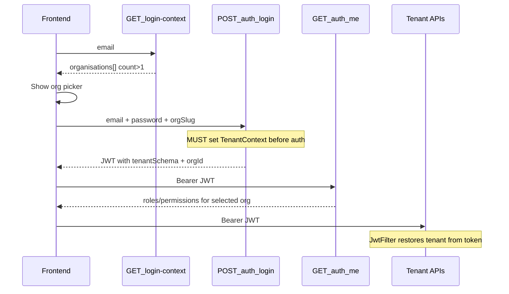

# Multi-Organization Auth — Frontend Integration Guide

Contract for **single API host** deployments (`api.*`), where the tenant is bound **only at login** via `orgSlug` / `orgId` and embedded into the JWT (`tenantSchema`, `orgId`). The browser must not rely on `X-Tenant-Subdomain` for staff sessions on a single host.

**Base path:** `/api/v1/auth`  
**Auth after login:** `Authorization: Bearer <accessToken>`  
**Tenant after login:** restored from JWT by the backend — do **not** send `X-Tenant-Subdomain` on single-host.

---

## Why this matters

If org selection is missing or the wrong identity is resolved, login may appear to succeed but later APIs return 401/403. The browser often surfaces this as **"Failed to fetch"**.



---

## Login flow

1. Call `GET /api/v1/auth/login-context?email={email}`
2. If `count > 1`, show an org picker using `organisations[]`
   - Display `name`, `slug`
   - Optionally label with `roles` (e.g. "Admin at Acme", "Therapist at Beta")
3. Call `POST /api/v1/auth/login` with **all of**:

```json
{
  "username": "user@example.com",
  "password": "...",
  "orgSlug": "selected-slug"
}
```

   Alternatives: `orgId`, or `orgIdentifier` + `orgValue` (`"slug"` / `"id"`).

4. Verify the login response before routing:
   - `tenantSchema` is present and **not** `"public"` for tenant staff portals
   - `organisationId` / `organisationSlug` match the selected org
   - `roles` match the expected portal (ADMIN → `/admin/*`, THERAPIST → `/therapist/*`)
5. Call `GET /api/v1/auth/me` **before** loading dashboard APIs; use `/me` roles as the source of truth for routing
6. Store the JWT (access + refresh). On single-host, let the JWT restore tenant — do not send `X-Tenant-Subdomain`

### Login response tenant fields

| Field | Meaning |
|-------|---------|
| `tenantSchema` | Schema bound into the JWT (e.g. `tenant_42`). `"public"` for platform-only sessions |
| `organisationId` | Organisation id bound into the JWT |
| `organisationSlug` | Slug for UI / routing when tenant-bound |

---

## Login-context org summaries

When `count > 1`, each entry in `organisations[]` may include:

```json
{
  "organisationId": 2,
  "name": "Beta Clinic",
  "slug": "beta",
  "subdomain": "beta",
  "status": "ACTIVE",
  "branding": { "...": "..." },
  "roles": ["ADMIN"],
  "username": "elena.admin"
}
```

Use `roles` only as a **hint** for picker labels. After login, prefer `GET /auth/me`.

Each org may also include `username` — the login identifier for **that** org’s auth identity. When a person has separate identities per org, usernames can differ even if the profile email is the same. Prefer showing / pre-filling that username for the selected org when it differs from the email.

---

## Forgot-password flow

1. Reuse the same org list from login-context (or `POST /api/v1/auth/resolve-tenant`)
2. Call `POST /api/v1/auth/forgot-password` with:

```json
{
  "email": "user@example.com",
  "orgSlug": "selected-slug"
}
```

3. Always show a generic success message (anti-enumeration). The body does not reveal whether the account exists.
4. If the response includes header `X-Auth-Hint: TENANT_SELECTION_REQUIRED`, re-show the org picker and retry with `orgSlug` / `orgId`

Notes:

- Omitting org when the email matches multiple STAFF identities will not send email; the API may return `X-Auth-Hint: TENANT_SELECTION_REQUIRED`
- An invalid org slug does not fall back to unscoped lookup (still HTTP 200, no email)

---

## Token refresh (single-host)

Refresh tokens include `tenantSchema` and `orgId`. On `POST /api/v1/auth/refresh`, the backend restores staff tenant context from those claims when the request hits the public schema host.

- Always send the refresh token issued at login
- Expect the new access/refresh pair to keep the same tenant binding (`tenantSchema`, `organisationId` in the response)
- If refresh fails with 401, clear the session and return to login

---

## Error handling

| Code / signal | Frontend action |
|---------------|-----------------|
| `409 TENANT_SELECTION_REQUIRED` | Show org picker; retry login with `orgSlug` |
| `400 EMAIL_NOT_IN_ORG` | "This email is not registered in the selected organization" |
| `400 INVALID_ORG_SELECTION` | "Organization not found" |
| `403 USER_BLOCKED_IN_ORG` | "This account is blocked for the selected organization" |
| `X-Auth-Hint: TENANT_SELECTION_REQUIRED` (forgot-password) | Re-show org picker; retry with `orgSlug` |
| `401` on post-login APIs | Clear session; redirect to login (likely missing tenant in JWT) |

---

## Checklist

- [ ] Org picker shown when login-context `count > 1`
- [ ] Login always sends `orgSlug` or `orgId` after picker selection
- [ ] Login response checked for non-`public` `tenantSchema` before portal routing
- [ ] `/auth/me` used before dashboard data fetches
- [ ] Forgot-password sends the same selected `orgSlug` / `orgId`
- [ ] Forgot-password handles `X-Auth-Hint: TENANT_SELECTION_REQUIRED`
- [ ] No `X-Tenant-Subdomain` required on single API host for staff JWT sessions
