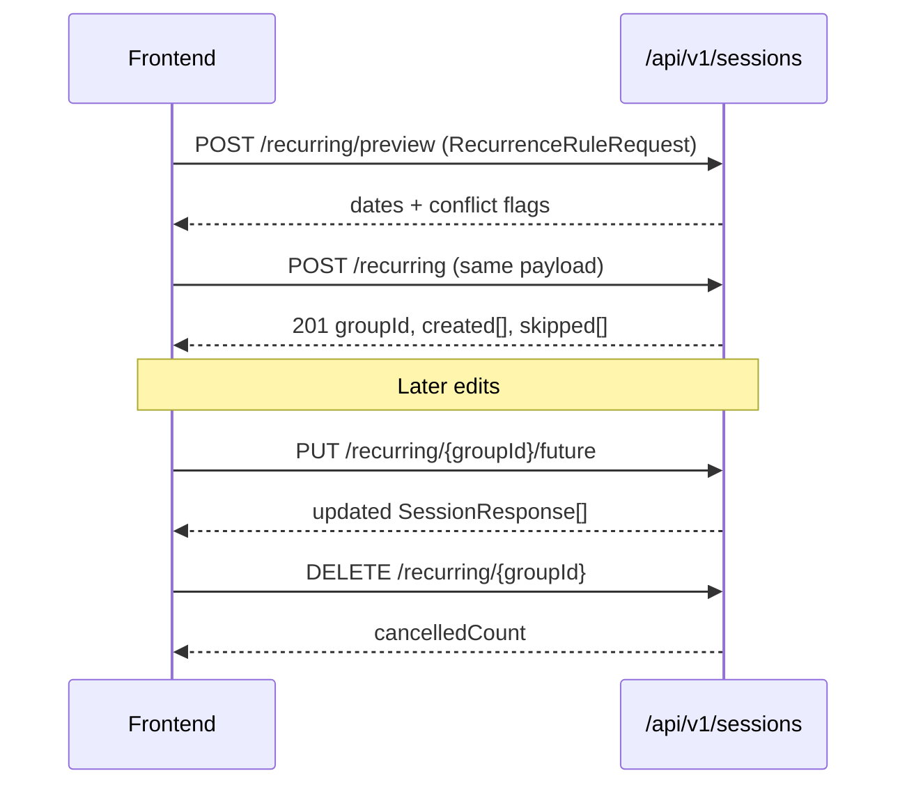

# Recurring Appointment Flow — Frontend Integration Guide

Base path: **`/api/v1/sessions`**

Auth: **Bearer JWT** on all endpoints

Roles: **Therapist or Admin** + specific permissions per endpoint

---

## Overview

Recurring appointments are a **4-step API flow**:

1. **Preview** — expand the recurrence rule and show conflicts (no DB write)
2. **Create** — book all conflict-free occurrences; skip conflicting dates
3. **Update future** — change the anchor session and shift all upcoming sessions in the series
4. **Cancel series** — cancel all upcoming sessions in the group

All sessions in a series share a **`recurrenceGroupId`** (format: `rec-{uuid}`), returned on create and on each `SessionResponse`.



**Single (non-recurring) sessions** use a separate endpoint: `POST /api/v1/sessions` with `CreateSessionRequest` (one `sessionDate` as ISO `Instant`). Do not use the recurring endpoints for one-off bookings.

---

## Shared Request: `RecurrenceRuleRequest`

Used by **preview** and **create**.

| Field | Type | Required | Notes |
|-------|------|----------|-------|
| `clientId` | `number` | Yes | |
| `therapistId` | `number` | Yes | |
| `serviceId` | `number` | Yes | Duration comes from service (default 60 min) |
| `roomId` | `number` | optional | Required for in-person room conflict checks |
| `sessionMode` | enum | Yes | `"online"` \| `"in-person"` |
| `sessionType` | `string` | optional | Clinical label, e.g. `"Psychotherapy"` |
| `notes` | `string` | optional | Applied to all created sessions |
| `zoomEnabled` | `boolean` | optional | default `false`. **Required `true` for online** |
| `startDate` | `string` | Yes | `YYYY-MM-DD` (practice timezone) |
| `sessionTime` | `string` | Yes | `HH:mm` 24h, e.g. `"14:00"` |
| `recurrenceType` | enum | Yes | `"weekly"` \| `"monthly"` |
| `daysOfWeek` | `number[]` | weekly only | `0=Sun … 6=Sat` |
| `monthsOfYear` | `number[]` | monthly only | optional `1–12` filter |
| `interval` | `number` | optional | default `1`, range `1–8` |
| `endMode` | enum | Yes | `"count"` \| `"until"` |
| `count` | `number` | if `endMode=count` | `1–60`, do not send `untilDate` |
| `untilDate` | `string` | if `endMode=until` | `YYYY-MM-DD`, do not send `count` |

### Enums

```json
// recurrenceType
"weekly" | "monthly"

// endMode
"count" | "until"

// sessionMode
"online" | "in-person"
```

### Recurrence Rules (Backend Behavior)

- **Timezone:** all date expansion uses **`America/New_York`**
- **Weekly:** matches selected `daysOfWeek` every N weeks (`interval`)
- **Monthly:** same day-of-month as `startDate` (clamped for short months), every N months; optional `monthsOfYear` filter
- **Caps:** max **60** occurrences; scans up to **730** days ahead
- **Business hours:** start ≥ **8:00 AM**; session must not extend past **midnight** same calendar day (practice TZ)
- **Duration:** from billing service `duration` (fallback 60 min) — not sent in recurring request

### Example — Weekly, 4 Sessions Mon/Wed

```json
{
  "clientId": 10,
  "therapistId": 1,
  "serviceId": 5,
  "roomId": 3,
  "sessionMode": "in-person",
  "sessionType": "Psychotherapy",
  "notes": "Weekly recurring",
  "zoomEnabled": false,
  "startDate": "2026-06-08",
  "sessionTime": "14:00",
  "recurrenceType": "weekly",
  "daysOfWeek": [1, 3],
  "interval": 1,
  "endMode": "count",
  "count": 4
}
```

### Example — Monthly Until Date

```json
{
  "clientId": 10,
  "therapistId": 1,
  "serviceId": 5,
  "sessionMode": "online",
  "zoomEnabled": true,
  "startDate": "2026-06-15",
  "sessionTime": "10:00",
  "recurrenceType": "monthly",
  "interval": 1,
  "endMode": "until",
  "untilDate": "2026-12-15"
}
```

---

## 1. Preview Recurring Dates

**`POST /api/v1/sessions/recurring/preview`**

**Permission:** `SESSION_VIEW`

**Response:** `200 OK`

Expands the rule and flags therapist/room conflicts. **Nothing is saved.**

### Response: `RecurrencePreviewResponse`

```json
{
  "sessions": [
    {
      "sessionDate": "2026-06-08T18:00:00Z",
      "localDate": "2026-06-08",
      "sessionTime": "14:00",
      "hasConflict": false,
      "reasons": []
    },
    {
      "sessionDate": "2026-06-10T18:00:00Z",
      "localDate": "2026-06-10",
      "sessionTime": "14:00",
      "hasConflict": true,
      "reasons": ["Therapist is busy"]
    }
  ],
  "totalRequested": 4,
  "freeCount": 3,
  "conflictCount": 1
}
```

| Field | Description |
|-------|-------------|
| `sessionDate` | UTC `Instant` for that occurrence |
| `localDate` | Practice-local date `YYYY-MM-DD` |
| `sessionTime` | `HH:mm` in practice timezone |
| `hasConflict` | Therapist or room overlap |
| `reasons` | `"Therapist is busy"` and/or `"Room is occupied"` |
| `totalRequested` | Total expanded occurrences |
| `freeCount` | Non-conflicting |
| `conflictCount` | Conflicting |

**Frontend tip:** Call preview on form change (debounced) before create. Show conflict badges per row; warn if `conflictCount > 0` that those dates will be skipped on create.

---

## 2. Create Recurring Series

**`POST /api/v1/sessions/recurring`**

**Permission:** `SESSION_CREATE`

**Response:** `201 Created`

Same body as preview. Creates all **non-conflicting** sessions under one `groupId`. Conflicting dates are **skipped** (partial success allowed).

### Response: `CreateRecurringSessionsResponse`

```json
{
  "groupId": "rec-a1b2c3d4-e5f6-7890-abcd-ef1234567890",
  "created": [],
  "createdCount": 3,
  "skipped": [
    {
      "sessionDate": "2026-06-10T18:00:00Z",
      "localDate": "2026-06-10",
      "sessionTime": "14:00",
      "reasons": ["Therapist is busy"]
    }
  ],
  "skippedCount": 1,
  "warning": null
}
```

| Field | Description |
|-------|-------------|
| `groupId` | Series identifier — store for edit/cancel |
| `created` | Full session objects (preferred) |
| `createdCount` | Number created |
| `skipped` | Dates not booked + reasons |
| `skippedCount` | Number skipped |
| `warning` | Non-fatal message (e.g. Zoom meeting creation issues) |

**Deprecated (still populated for backward compatibility — prefer `created` / `skipped`):**

- `requested`
- `failed`
- `sessions`
- `errors`

### `SessionResponse` (each created/listed session)

```json
{
  "id": 101,
  "clientId": 10,
  "clientName": "Jane Doe",
  "therapistId": 1,
  "therapistName": "Dr. Smith",
  "sessionDate": "2026-06-08T18:00:00Z",
  "duration": 60,
  "sessionType": "Psychotherapy",
  "sessionMode": "in-person",
  "status": "scheduled",
  "serviceId": 5,
  "serviceName": "Psychotherapy 45 min",
  "roomId": 3,
  "roomName": "Room A",
  "notes": "Weekly recurring",
  "zoomEnabled": false,
  "zoomMeetingId": null,
  "zoomJoinUrl": null,
  "zoomPassword": null,
  "recurrenceGroupId": "rec-a1b2c3d4-...",
  "createdAt": "2026-06-11T12:00:00Z",
  "updatedAt": "2026-06-11T12:00:00Z"
}
```

### Create Outcomes

| HTTP | When |
|------|------|
| `201` | At least one session created (may have `skippedCount > 0`) |
| `409` | **All** dates conflict — nothing created |
| `400` | Validation / business hours / online+Zoom rules |
| `403` | Client/therapist access denied |
| `404` | Client, therapist, or service not found |

### 409 Conflict Response (All Dates Conflict)

```json
{
  "timestamp": "2026-06-11T12:00:00Z",
  "status": 409,
  "error": "Conflict",
  "message": "All recurrence dates conflict with existing sessions",
  "code": "SESSION_002",
  "path": "/api/v1/sessions/recurring",
  "traceId": "...",
  "details": {
    "conflict": [
      {
        "sessionDate": "2026-06-08T18:00:00Z",
        "localDate": "2026-06-08",
        "sessionTime": "14:00",
        "reasons": ["Therapist is busy"]
      }
    ]
  }
}
```

**Online sessions:** `sessionMode: "online"` requires `zoomEnabled: true` and therapist Zoom configured, or `400`.

---

## 3. Update This and All Future Sessions

**`PUT /api/v1/sessions/recurring/{groupId}/future`**

**Permission:** `SESSION_EDIT`

**Response:** `200 OK` — array of updated `SessionResponse`

Edits the **anchor session** and every **upcoming** session in the series (`sessionDate >= anchor's original date`, status `scheduled` or `confirmed`).

### Path Param

- `groupId` — must start with `rec-` (from create response or `SessionResponse.recurrenceGroupId`)

### Request: `UpdateRecurringFutureRequest`

| Field | Type | Required | Notes |
|-------|------|----------|-------|
| `anchorId` | `number` | Yes | Session ID in this series |
| `sessionDate` | ISO datetime | Yes | New anchor date/time (UTC `Instant`) |
| `roomId` | `number` | optional | Omit to keep current |
| `notes` | `string` | optional | |
| `serviceId` | `number` | optional | |
| `therapistId` | `number` | optional | |
| `sessionType` | `string` | optional | Clinical type |
| `sessionMode` | enum | optional | `online` / `in-person` |
| `zoomEnabled` | `boolean` | optional | |
| `ignoreConflicts` | `boolean` | optional | default `false` |

### Example

```json
{
  "anchorId": 105,
  "sessionDate": "2026-06-11T19:00:00Z",
  "roomId": 4,
  "notes": "Moved to Room B",
  "ignoreConflicts": false
}
```

### How the Shift Works

1. Compute **day delta** between anchor's old local date and new local date (practice TZ).
2. Apply **new time-of-day** from `sessionDate` to every future session.
3. Each session's date becomes: `originalLocalDate + dayDelta` at `newTime`.
4. Optional fields update only when sent (patch semantics).

**Conflict check:** unless `ignoreConflicts: true`, any therapist/room conflict with **external** sessions (outside this `groupId`) → `409`.

### Response

```json
[
  {
    "id": 105,
    "recurrenceGroupId": "rec-abc...",
    "sessionDate": "2026-06-11T19:00:00Z"
  },
  {
    "id": 106,
    "recurrenceGroupId": "rec-abc...",
    "sessionDate": "2026-06-13T19:00:00Z"
  }
]
```

### Outcomes

| HTTP | When |
|------|------|
| `200` | Success |
| `400` | Invalid `groupId`, anchor not in series, business hours |
| `404` | Anchor not found, or no upcoming sessions |
| `409` | Scheduling conflict on series update |
| `403` | Edit access denied |

---

## 4. Cancel Upcoming Series Sessions

**`DELETE /api/v1/sessions/recurring/{groupId}`**

**Permission:** `SESSION_DELETE`

**Response:** `200 OK`

Cancels all sessions in the group where:

- `sessionDate >= now`
- status is `scheduled` or `confirmed`

Past and already-completed/cancelled sessions are **not** changed.

### Response: `CancelRecurringSeriesResponse`

```json
{
  "groupId": "rec-a1b2c3d4-...",
  "cancelledCount": 3
}
```

### Outcomes

| HTTP | When |
|------|------|
| `200` | Success (`cancelledCount` may be `0`) |
| `400` | Invalid `groupId` format |
| `404` | Series not found |
| `403` | Delete access denied |

---

## Permissions Summary

| Endpoint | Permission |
|----------|------------|
| `POST .../recurring/preview` | `SESSION_VIEW` |
| `POST .../recurring` | `SESSION_CREATE` |
| `PUT .../recurring/{groupId}/future` | `SESSION_EDIT` |
| `DELETE .../recurring/{groupId}` | `SESSION_DELETE` |

Access is further scoped by client visibility (`CLIENT_VIEW_ALL` / `OWN` / `TEAM`).

---

## Recommended Frontend Flow

### Create Wizard

```
1. User fills recurrence form
2. POST /recurring/preview → show calendar list with conflict badges
3. If freeCount === 0 → block submit, show errors
4. If conflictCount > 0 → confirm: "X dates will be skipped"
5. POST /recurring → store groupId + created sessions
6. If skippedCount > 0 → toast/summary of skipped dates
7. If warning present → show Zoom warning (sessions still created)
```

### Edit Series ("This and Future")

```
1. User opens a session with recurrenceGroupId set
2. "Edit this and future" → PUT /recurring/{groupId}/future
   - anchorId = current session id
   - sessionDate = new anchor datetime
3. Refresh calendar from returned array
```

### Cancel Series

```
1. From any session in series → confirm
2. DELETE /recurring/{groupId}
3. Show cancelledCount; refresh list
```

### Grouping in UI

- Use `recurrenceGroupId` on `SessionResponse` to group sessions in calendar/list
- No dedicated "get series by groupId" endpoint — filter client-side from `GET /api/v1/sessions` results, or load sessions and group by `recurrenceGroupId`

---

## Validation Errors (`400`)

Standard error shape:

```json
{
  "status": 400,
  "error": "Bad Request",
  "message": "...",
  "code": "...",
  "details": {}
}
```

Common recurring validation messages:

- `"Count is required when endMode is count"`
- `"Until date is required when endMode is until"`
- `"At least one day of week is required for weekly recurrence"`
- `"daysOfWeek is only used for weekly recurrence"`
- `"Session time must be HH:mm"`
- `"Sessions cannot be scheduled before 8:00 AM in America/New_York"`
- `"Online session requires Zoom. Please enable Zoom for the session."`

---

## Conflict Detection Reference

Conflicts checked against sessions with status: **`scheduled`**, **`confirmed`**, **`in_progress`**.

| Reason | Meaning |
|--------|---------|
| `"Therapist is busy"` | Therapist has overlapping session |
| `"Room is occupied"` | Room has overlapping session (only if `roomId` set) |

Overlap uses each session's `duration` (from service or 60 min default).

---

## Key Differences vs Single Session Create

| | Single `POST /sessions` | Recurring `POST /sessions/recurring` |
|--|--------------------------|-------------------------------------|
| Date input | `sessionDate` (ISO Instant) | `startDate` + `sessionTime` + recurrence rule |
| Duration | Optional in request | From `serviceId` only |
| Multiple dates | No | Yes (up to 60) |
| Group ID | `null` | `recurrenceGroupId` on all sessions |
| Conflicts | Per request (`ignoreConflicts`) | Auto-skip per date; 409 if all fail |
| Partial success | N/A | Yes (`created` + `skipped`) |

---

## Related Source Files

| File | Purpose |
|------|---------|
| `session/controller/SessionController.java` | REST endpoints |
| `session/service/RecurringSessionService.java` | Business logic |
| `session/service/RecurrenceDateExpander.java` | Date expansion rules |
| `session/dto/RecurrenceRuleRequest.java` | Preview/create payload |
| `session/dto/UpdateRecurringFutureRequest.java` | Update-future payload |
| `session/validation/RecurrenceRuleValidator.java` | Cross-field validation |
