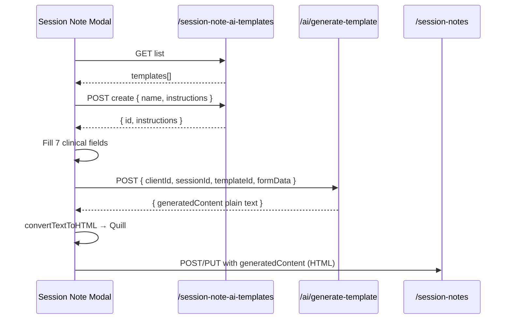

# Session Note AI Template — Frontend Integration Guide

> **Scope:** Create/Edit template dialog + Generate Final Note in the **Session Note modal**.
>
> **Backend base path:** `/api/v1`

---

## 1. Feature split

| Step | Backend API |
|------|-------------|
| List / select templates | `GET /api/v1/session-note-ai-templates` |
| Create template | `POST /api/v1/session-note-ai-templates` |
| Edit template | `PUT /api/v1/session-note-ai-templates/{id}` |
| Delete template | `DELETE /api/v1/session-note-ai-templates/{id}` |
| Mark last used (dropdown default) | `POST /api/v1/session-note-ai-templates/{id}/mark-last-used` |
| Generate Final Note | `POST /api/v1/ai/generate-template` |
| Save note | `POST/PUT /api/v1/session-notes` |
| Finalize | `POST /api/v1/session-notes/{id}/finalize` |

Templates are **per therapist** (owned by the logged-in user). Do not use `localStorage` for production — use the APIs below.

---

## 2. Create / Edit Template flow

### 2.1 List templates (on modal open)

```
GET /api/v1/session-note-ai-templates
Authorization: Bearer {token}
```

**Response:** `200` array ordered by most recently used first.

```json
[
  {
    "id": 12,
    "name": "CBT Session Template",
    "instructions": "Create a CBT-focused session note including homework...",
    "lastUsedAt": "2026-06-24T12:00:00Z",
    "createdAt": "2026-06-20T09:00:00Z",
    "updatedAt": "2026-06-24T12:00:00Z"
  }
]
```

**Frontend state:**
- `savedTemplates` ← API list
- `selectedTemplateId` ← first item or highest `lastUsedAt`
- `savedTemplate` ← selected item's `instructions` string (for generate fallback)

### 2.2 Create template (Save Template — new)

```
POST /api/v1/session-note-ai-templates
Content-Type: application/json
```

```json
{
  "name": "CBT Session Template",
  "instructions": "Create a session note focused on cognitive behavioral therapy..."
}
```

**Response:** `201` + template object (includes `id`).

**On success:**
1. Add to dropdown list.
2. Set `selectedTemplateId = response.id`.
3. Set `savedTemplate = response.instructions`.
4. Close dialog.

### 2.3 Edit template (Save Template — existing)

```
PUT /api/v1/session-note-ai-templates/{id}
```

```json
{
  "name": "CBT Session Template (updated)",
  "instructions": "Updated instructions..."
}
```

Both fields optional on update, but instructions cannot be empty if sent.

### 2.4 Delete template

```
DELETE /api/v1/session-note-ai-templates/{id}
```

**Response:** `204`. Clear selection if deleted template was active.

### 2.5 Mark last used (dropdown selection)

When user picks a template from the dropdown:

```
POST /api/v1/session-note-ai-templates/{id}/mark-last-used
```

**Response:** `200` updated template. Replaces legacy `localStorage.lastUsedTemplate`.

---

## 3. Generate Final Note flow

### 3.1 Client-side pre-checks

```typescript
if (!selectedTemplateId && !savedTemplate?.trim()) {
  toast.error("Please create or select a template first");
  return;
}
if (!sessionId) {
  toast.error("Please select a session first");
  return;
}
// At least one clinical field filled (sessionFocus, symptoms, shortTermGoals,
// intervention, progress, remarks)
```

### 3.2 API call (preferred: send templateId)

```
POST /api/v1/ai/generate-template
```

**Option A — use saved template (recommended):**

```json
{
  "clientId": 42,
  "sessionId": 101,
  "templateId": 12,
  "formData": {
    "sessionFocus": "...",
    "symptoms": "...",
    "shortTermGoals": "...",
    "intervention": "...",
    "progress": "...",
    "remarks": "...",
    "recommendations": "..."
  }
}
```

**Option B — unsaved edits in dialog (override):**

```json
{
  "clientId": 42,
  "sessionId": 101,
  "customInstructions": "Edited instructions not yet saved...",
  "formData": { "...": "..." }
}
```

**Resolution order on backend:**
1. If `customInstructions` is non-empty → use it.
2. Else if `templateId` → load instructions from DB (must belong to current user).
3. Else → `400`.

Backend auto-calls `mark-last-used` when `templateId` is sent on generate.

### 3.3 Success response

```json
{
  "generatedContent": "SESSION FOCUS\n\nClient discussed...\n\n"
}
```

Plain text only. Frontend converts to HTML for Quill (`convertTextToHTML`). Preview tab shows plain text.

### 3.4 Errors

| Status | When |
|--------|------|
| `400` | Missing `templateId` and `customInstructions` |
| `403` | AI processing consent not granted |
| `404` | Template or session not found / no access |
| `503` | OpenAI not configured |

---

## 4. End-to-end sequence



---

## 5. Save note payload

```json
{
  "sessionId": 101,
  "clientId": 42,
  "therapistId": 5,
  "date": "2026-06-24T14:00:00.000Z",
  "sessionFocus": "...",
  "generatedContent": "<p>...</p>",
  "isDraft": true,
  "isFinalized": false,
  "aiEnabled": false
}
```

> Set `aiEnabled: false` — do not trigger legacy async AI on create.

---

## 6. RTK Query sketch

```typescript
// templates
getSessionNoteAiTemplates: builder.query<SessionNoteAiTemplate[], void>({
  query: () => "/api/v1/session-note-ai-templates",
}),
createSessionNoteAiTemplate: builder.mutation<SessionNoteAiTemplate, { name: string; instructions: string }>({
  query: (body) => ({ url: "/api/v1/session-note-ai-templates", method: "POST", body }),
}),
updateSessionNoteAiTemplate: builder.mutation<SessionNoteAiTemplate, { id: number; name?: string; instructions?: string }>({
  query: ({ id, ...body }) => ({ url: `/api/v1/session-note-ai-templates/${id}`, method: "PUT", body }),
}),
deleteSessionNoteAiTemplate: builder.mutation<void, number>({
  query: (id) => ({ url: `/api/v1/session-note-ai-templates/${id}`, method: "DELETE" }),
}),
markSessionNoteAiTemplateLastUsed: builder.mutation<SessionNoteAiTemplate, number>({
  query: (id) => ({ url: `/api/v1/session-note-ai-templates/${id}/mark-last-used`, method: "POST" }),
}),

// generate
generateSessionNoteFinalContent: builder.mutation<
  { generatedContent: string },
  { clientId: number; sessionId: number; templateId?: number; customInstructions?: string; formData: Record<string, string> }
>({
  query: (body) => ({ url: "/api/v1/ai/generate-template", method: "POST", body }),
}),
```

---

## 7. Do NOT use

| Endpoint | Reason |
|----------|--------|
| `GET /api/v1/ai/templates` | Legacy static templates |
| `POST /api/v1/report-templates` | Admin client reports — different module |
| `localStorage.aiSessionTemplates` | Replaced by DB templates |

---

## 8. QA checklist

- [ ] Create template → appears in dropdown after reload (new browser/device)
- [ ] Edit template → generate uses updated instructions
- [ ] Delete template → removed from list
- [ ] Generate with `templateId` only → works
- [ ] Generate with unsaved `customInstructions` → overrides saved template
- [ ] Generate without consent → 403
- [ ] Save draft preserves `generatedContent`

---

*See also: `docs/session-note-ai-template-rebuild.md`*
