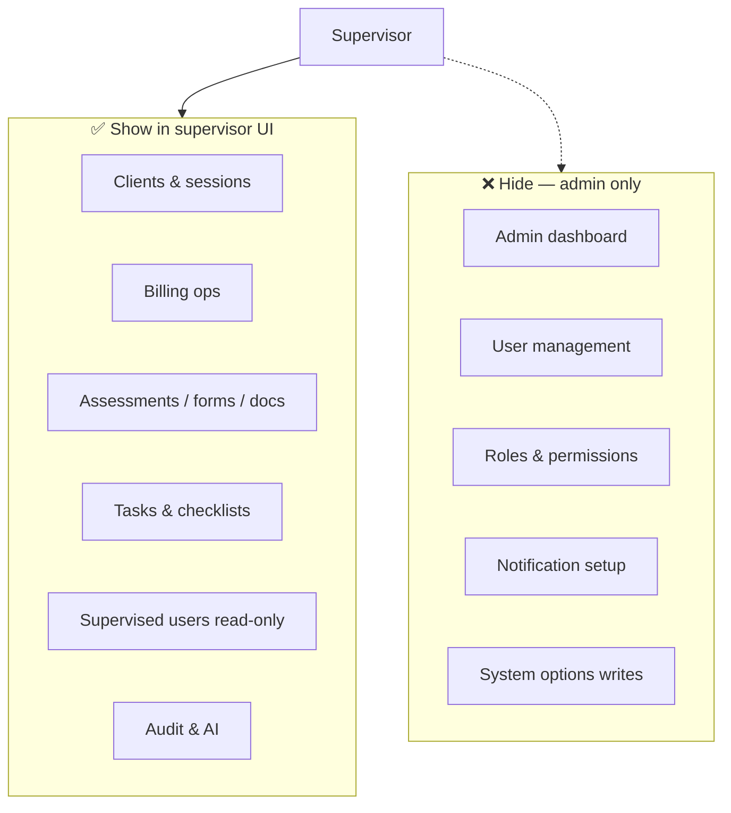

# Supervisor API — Frontend Integration Guide

Reference for building the **SUPERVISOR** staff experience in TherapyFlow.

**Base URL:** `/api/v1`  
**Auth:** `Authorization: Bearer <JWT>` (staff token)  
**Error shape:** Standard `ErrorResponse` (`status`, `error`, `message`, `code`, `path`, `traceId`, `details`)

**Related docs:** [Client API](./client-api.md) · [Recurring sessions](./recurring-sessions.md) · Swagger UI `/swagger-ui.html`

---

## Table of Contents

1. [Overview](#overview)
2. [Auth & JWT](#auth--jwt)
3. [Permissions & data scope](#permissions--data-scope)
4. [UI routing checklist](#ui-routing-checklist)
5. [Endpoint access by module](#endpoint-access-by-module)
6. [Blocked routes (hide in UI)](#blocked-routes-hide-in-ui)
7. [Known backend mismatches](#known-backend-mismatches)
8. [Transcription (REST + WebSocket)](#transcription-rest--websocket)
9. [Quick permission reference](#quick-permission-reference)

---

## Overview

Supervisor is a **clinical oversight** role — not a tenant admin. The frontend should expose most clinical, billing, and audit workflows, but **hide admin configuration** (users, RBAC, notification setup, system options writes).

| Aspect | Supervisor |
|--------|------------|
| **JWT role** | `SUPERVISOR` |
| **Compared to therapist** | Broader org visibility (clients/sessions), billing edit, audit, room manage, bulk imports |
| **Compared to admin** | No user CRUD, no RBAC, no admin dashboard, no notification/system admin config |
| **User directory scope** | Self + **assigned supervisees only** |
| **Client/session scope** | **Org-wide** (seed includes `CLIENT_VIEW_ALL`) |



**Legend used in endpoint tables:** ✅ Allowed · ⚠️ Allowed with scope/restriction · ❌ Blocked (403)

---

## Auth & JWT

### Login

Use the same staff auth flow as therapist/admin:

| Method | Path | Auth |
|--------|------|------|
| `POST` | `/api/v1/auth/login` | Public |
| `POST` | `/api/v1/auth/refresh` | Refresh token |
| `GET` | `/api/v1/auth/me` | Bearer JWT |
| `POST` | `/api/v1/auth/logout` | Bearer JWT |

### Detecting supervisor in the frontend

After login or `GET /auth/me`, check:

```typescript
// Roles (Spring Security)
const roles = jwt.roles ?? []; // e.g. ["SUPERVISOR"]
const isSupervisor = roles.includes("SUPERVISOR");

// Permissions (authorities)
const authorities = jwt.authorities ?? []; // e.g. ["CLIENT_VIEW_ALL", "SESSION_EDIT", ...]
const can = (perm: string) => authorities.includes(perm);
```

**Do not** infer access from role alone — some routes require both role **and** permission, and a few routes use role lists that exclude supervisor even when the permission exists (see [Known backend mismatches](#known-backend-mismatches)).

### Recommended guard pattern

```typescript
function canAccessSupervisorRoute(
  roles: string[],
  authorities: string[],
  opts: { roles?: string[]; permissions?: string[]; anyPermission?: string[] }
): boolean {
  if (!roles.includes("SUPERVISOR")) return false;
  if (opts.roles?.length && !opts.roles.some((r) => roles.includes(r))) return false;
  if (opts.permissions?.length && !opts.permissions.every((p) => authorities.includes(p))) return false;
  if (opts.anyPermission?.length && !opts.anyPermission.some((p) => authorities.includes(p))) return false;
  return true;
}
```

---

## Permissions & data scope

### Seeded permissions (SUPERVISOR)

From `V2__platform_seed_core.sql`:

**Granted:**  
`USER_VIEW`, `CLIENT_VIEW_OWN`, `CLIENT_VIEW_TEAM`, `CLIENT_VIEW_ALL`, `CLIENT_VIEW`, `CLIENT_CREATE`, `CLIENT_EDIT`, `CLIENT_DELETE`, `CLIENT_EXPORT`, `SESSION_*`, `ASSESSMENT_*`, `FORM_*`, `BILLING_VIEW`, `BILLING_MANAGE`, `BILLING_CREATE`, `BILLING_EDIT`, `BILLING_EXPORT`, `REPORT_VIEW`, `AUDIT_VIEW`, `AUDIT_EXPORT`, `ROOM_MANAGE`, `CONSENT_ADMIN_VIEW`, `AI_USE`

**Not granted:**  
`USER_CREATE`, `USER_EDIT`, `USER_DELETE`, `USER_MANAGE`, `BILLING_DELETE`, `REPORT_EXPORT`, `CLIENT_PORTAL_ACCESS`, platform roles

### Data scope rules (service layer)

These apply **after** the controller allows the request. Frontend filters should mirror them where possible.

| Resource | Scope for supervisor | Why |
|----------|----------------------|-----|
| **Clients** (list, detail, stats) | Entire organisation | `CLIENT_VIEW_ALL` wins in `ClientService` |
| **Sessions** (list, CRUD, transcripts) | Entire organisation | Same via `CLIENT_VIEW_ALL` in session services |
| **Users** (list, detail) | Self + supervised therapists | `UserService` applies `limitToSupervisorAssignments` |
| **Supervisor assignments** (GET) | Own assignments only | Filtered in service when not admin |
| **Bulk client updates** | Clients assigned to supervised therapists | Extra validation despite org-wide list |
| **Session check-overdue job** | Supervised therapists only | Role branch in `SessionService` |
| **Directory** (`entityType=USER`) | Supervised therapists + self | Same user scoping |
| **Directory** (`entityType=CLIENT`) | All clients | `CLIENT_VIEW_ALL` |

> **UX note:** Supervisor sees **all clients** in lists but only **supervised therapists** in user pickers. Design filters accordingly (e.g. default therapist filter to supervisees).

---

## UI routing checklist

Use this to show/hide nav items. When in doubt, call the API and handle `403`.

| Screen / feature | Show for supervisor? | Notes |
|------------------|----------------------|-------|
| Admin dashboard (`/admin/dashboard`) | ❌ | Use clinical dashboards instead |
| Therapist dashboard (`/therapists/dashboard/summary`) | ❌ | `ROLE_THERAPIST` only |
| Clients (CRUD, export, sub-resources) | ✅ | Hide **delete client**, **restore**, **bulk portal access** |
| Sessions (CRUD, calendar, recurring) | ✅ | Full access including transcription |
| Bulk client/session import | ✅ | Admin-or-supervisor endpoints |
| Users list / user detail (read) | ⚠️ | Supervised therapists only; hide create/edit/delete |
| Supervisor assignments (read) | ✅ | Hide create/edit/delete |
| Billing (invoices, payments, stats) | ✅ | Hide service catalog admin & invoice policy CRUD |
| Stripe Connect settings | ✅ | `BILLING_MANAGE` |
| Assessments & forms | ✅ | Includes template management |
| Documents, notes, library | ✅ | Hide library **tag** admin |
| Tasks & checklist instances | ✅ | Hide checklist **template** admin |
| Rooms | ✅ | Includes create/edit/delete |
| Consents admin | ✅ | `/admin/consents` explicitly allows supervisor |
| Notifications inbox & preferences | ✅ | Hide triggers/templates/setup admin |
| Audit log | ✅ | View + export |
| AI assistant / session note AI | ✅ | Requires `AI_USE` |
| System options (read) | ✅ | Hide category/option CRUD |
| Practice configuration (read) | ✅ | Hide PUT |
| Roles & permissions | ❌ | `USER_MANAGE` |
| Admin users (`/admin/users`) | ❌ | Admin role gate |
| Platform / super-admin | ❌ | Platform JWT only |
| Client portal (`/portal`) | ❌ | Client role only |

---

## Endpoint access by module

Paths are relative to `/api/v1` unless noted.

### Auth — `/auth`

| Method | Path | Access | Notes |
|--------|------|--------|-------|
| `POST` | `/auth/login` | ✅ | Public |
| `POST` | `/auth/refresh` | ✅ | Public |
| `GET` | `/auth/me` | ✅ | Returns roles + authorities |
| `POST` | `/auth/logout` | ✅ | |
| `POST` | `/auth/change-password` | ✅ | |
| `POST` | `/auth/forgot-password` | ✅ | Public |
| `POST` | `/auth/reset-password` | ✅ | Public |

### Users — `/users`

| Method | Path | Access | Notes |
|--------|------|--------|-------|
| `GET` | `/users` | ⚠️ | Supervised therapists + self |
| `GET` | `/users/{id}` | ⚠️ | Same |
| `GET` | `/users/{id}/activity` | ⚠️ | `USER_VIEW` |
| `GET` | `/users/{id}/profile` | ⚠️ | View only |
| `GET` | `/users/supervisor-assignments` | ✅ | Own assignments |
| `GET` | `/users/supervisor-assignments/{id}` | ✅ | |
| `GET` | `/users/me`, `/users/me/profile` | ✅ | Own profile |
| `PUT/PATCH` | `/users/me`, `/users/me/profile` | ✅ | Own profile |
| `POST/PUT/PATCH/DELETE` | `/users`, `/users/{id}`, `/users/{id}/profile` | ❌ | Admin or missing `USER_EDIT` |
| `POST/PUT/DELETE` | `/users/supervisor-assignments` | ❌ | `USER_MANAGE` |

### Admin directory — `/admin/directory`

| Method | Path | Access | Notes |
|--------|------|--------|-------|
| `GET` | `/admin/directory` | ⚠️ | `entityType=USER` → supervisees; `CLIENT` → all |

### Clients — `/clients`

See [Client API](./client-api.md) for request/response shapes. Supervisor summary:

| Method | Path | Access | Notes |
|--------|------|--------|-------|
| `GET` | `/clients`, `/clients/stats`, `/clients/{id}` | ✅ | Org-wide |
| `POST/PUT/PATCH` | `/clients`, `/clients/{id}` | ✅ | |
| `GET` | `/clients/export` | ✅ | `CLIENT_EXPORT` |
| `POST` | `/clients/bulk-upload` | ✅ | Admin or supervisor |
| `POST` | `/clients/bulk-update-stage`, `/bulk-reassign-therapist`, `/bulk-update-status` | ⚠️ | Supervised-therapist clients only |
| `GET` | `/clients/duplicates` | ✅ | Admin or supervisor |
| `GET/POST/PUT/DELETE` | `/clients/{clientId}/contacts\|addresses\|insurance\|referral\|employment` | ✅ | |
| `GET` | `/clients/{clientId}/sessions`, `/sessions/summary`, `/session-transcripts/status` | ✅ | |
| `DELETE` | `/clients/{id}` | ❌ | `ROLE_ADMIN` only |
| `POST` | `/clients/{id}/restore` | ❌ | Admin only |
| `POST` | `/clients/bulk-portal-access` | ❌ | Admin only |

### Client filters — `/client-filters`

| Method | Path | Access |
|--------|------|--------|
| `GET` | `/client-filters/batch` | ✅ |

### Consents — `/admin/consents`

| Method | Path | Access | Notes |
|--------|------|--------|-------|
| `GET` | `/admin/consents/management`, `/`, `/clients/{clientId}` | ✅ | Admin **or** supervisor |
| `POST` | `/admin/consents/clients/{clientId}`, `.../verbal-ai-consent` | ✅ | Admin, supervisor, or therapist |

### Sessions — `/sessions`

| Method | Path | Access | Notes |
|--------|------|--------|-------|
| `GET` | `/sessions`, `/sessions/{id}`, history/upcoming/overdue routes | ✅ | Org-wide |
| `POST/PUT/DELETE` | `/sessions`, `/sessions/{id}`, recurring routes | ✅ | |
| `POST` | `/sessions/bulk-upload/*`, `/sessions/bulk-upload/import` | ✅ | Admin or supervisor |
| `POST` | `/sessions/check-overdue` | ⚠️ | Supervised therapists only |
| `GET/POST` | `/sessions/{id}/billing` | ✅ | |
| `POST` | `/sessions/{sessionId}/transcribe-start` | ✅ | See [Transcription](#transcription-rest--websocket) |
| `POST` | `/sessions/{sessionId}/transcribe-chunk` | ✅ | Multipart audio |
| `POST` | `/sessions/{sessionId}/transcribe-finalize` | ✅ | |
| `GET/DELETE` | `/sessions/{sessionId}/transcript` | ✅ | |

### Session transcripts — `/session-transcripts`

| Method | Path | Access |
|--------|------|--------|
| `GET` | `/session-transcripts/status` | ✅ |

### Session notes — `/session-notes`

All routes: ✅ (`CONSENT_ADMIN_VIEW`) — list, CRUD, finalize, transcribe, PDF.

### Rooms — `/rooms`

| Method | Path | Access | Notes |
|--------|------|--------|-------|
| `GET` | `/rooms`, availability routes | ✅ | |
| `POST/PUT/DELETE` | `/rooms`, `/rooms/{roomId}` | ✅ | `ROOM_MANAGE` |

### Therapist availability — `/therapist-availability`

All routes: ✅ (`THERAPIST_OR_ADMIN` + `CONSENT_ADMIN_VIEW`).

### Billing — `/billing`

| Method | Path | Access | Notes |
|--------|------|--------|-------|
| `GET` | `/billing`, `/billing/{id}`, stats, history, exports | ✅ | |
| `PATCH/POST` | Payment status, record payment, refunds, void, email | ✅ | Supervisor in role list |
| `GET` | `/billing/subscription/me` | ✅ | |
| `GET` | `/billing/subscription/invoices` | ✅ | |
| `POST` | `/billing/subscription/invoices/{id}/pay` | ❌ | Billing specialist or admin only |
| `POST/PUT/DELETE` | `/billing/services`, `/billing/services/{id}` | ❌ | Admin only |
| `POST` | `/billing/services/visibility/therapists/*` | ❌ | Admin only |

### Invoice policies — `/billing/invoice-policies`

| Method | Path | Access |
|--------|------|--------|
| `GET` | `/billing/invoice-policies`, `/options/*` | ✅ |
| `POST/PUT/DELETE` | `/billing/invoice-policies` | ❌ Admin |

### Stripe Connect — `/admin/stripe-connect`

All routes: ✅ (`BILLING_MANAGE`) — status, OAuth, config.

### Assessments — `/assessments`

All staff assessment routes: ✅ (`ASSESSMENT_VIEW`, `ASSESSMENT_ASSIGN`, or `CONSENT_ADMIN_VIEW`).

### Forms — `/forms`

Template CRUD + assignments: ✅ (`FORM_*`, `CONSENT_ADMIN_VIEW`).

### Documents — `/clients/{clientId}/documents`

All routes: ✅ (`CONSENT_ADMIN_VIEW`).

### Document reviews — `/documents`

| Method | Path | Access |
|--------|------|--------|
| `GET` | `/documents/reviews`, `/reviews/summary`, `/reviews/dashboard` | ✅ |

### Notes — `/notes`

| Method | Path | Access |
|--------|------|--------|
| `GET/POST/PATCH/DELETE` | `/notes`, `/notes/clients/{clientId}/notes` | ✅ |

### Library — `/library`

| Method | Path | Access | Notes |
|--------|------|--------|-------|
| `GET/POST/PUT/DELETE` | Categories, entries, connections (most) | ✅ | `USER_VIEW` or `CONSENT_ADMIN_VIEW` |
| `POST/DELETE` | `/library/tags`, `/library/tags/{id}` | ❌ | `USER_MANAGE` |

### Tasks — `/tasks`

All task + comment routes: ✅ (`CONSENT_ADMIN_VIEW`).

### Checklists — `/checklists`

| Method | Path | Access | Notes |
|--------|------|--------|-------|
| `GET/POST/PUT` | Client checklist instances | ✅ | |
| `GET` | `/checklists/checklist-templates` | ✅ | Read templates |
| `POST/PATCH/DELETE` | `/checklists/checklist-templates` | ❌ | Template admin — `USER_MANAGE` |

### Notifications — `/notifications`

| Method | Path | Access | Notes |
|--------|------|--------|-------|
| `GET` | `/notifications`, `/unread/count` | ✅ | Inbox |
| `PATCH/DELETE` | Read, delete own notifications | ✅ | |
| `GET/PUT` | `/notifications/preferences` | ✅ | |
| `GET/POST/PUT/DELETE` | `/notifications/triggers`, `/templates`, `/setup/*` | ❌ | Admin notification config |

### System — `/system-options`, `/practice-configuration`

| Method | Path | Access |
|--------|------|--------|
| `GET` | `/system-options`, `/system-options/categories`, `/by-category/{key}` | ✅ |
| `GET` | `/practice-configuration` | ✅ |
| `POST/PUT/DELETE` | System option categories/options | ❌ `USER_MANAGE` |
| `PUT` | `/practice-configuration` | ❌ `USER_MANAGE` |

### Audit — `/audit`

| Method | Path | Access |
|--------|------|--------|
| `GET` | `/audit/logs`, `/dashboard`, `/stats`, `/clients/{clientId}`, `/global-health` | ✅ |
| `GET` | `/audit/export` | ✅ `AUDIT_EXPORT` |

### AI — `/ai`

All routes: ✅ (`AI_USE`) — session notes, chat, templates, clinical report, regenerate.

---

## Blocked routes (hide in UI)

These return **403** for supervisor. Do not mount admin-only pages.

| Area | Base path | Block reason |
|------|-----------|--------------|
| Admin dashboard | `/admin/dashboard/summary` | `ROLE_ADMIN` |
| Admin users | `/admin/users/**` | `ROLE_ADMIN` |
| Admin integrations health | `/admin/integrations/**` | `ROLE_ADMIN` |
| RBAC | `/roles`, `/permissions`, `/tenant-admin/**` | `USER_MANAGE` |
| Notification admin | `/notifications/triggers`, `/templates`, `/setup/**`, `/broadcast` | `USER_MANAGE` |
| Checklist template admin | `POST/PATCH/DELETE /checklists/checklist-templates/**` | `USER_MANAGE` |
| System options writes | `POST/PUT/DELETE /system-options/**` | `USER_MANAGE` |
| Therapist dashboard | `/therapists/dashboard/summary` | `ROLE_THERAPIST` |
| Client portal | `/portal/**` | `CLIENT_PORTAL_ACCESS` |
| Platform | `/super-admin/**`, `/api/super-admin/**` | Platform roles |

---

## Known backend mismatches

Frontend should **hide** these actions even if `authorities` includes the permission:

| Permission in JWT | UI action | Actual API gate |
|-------------------|-----------|-----------------|
| `CLIENT_DELETE` | Delete client | ❌ `DELETE /clients/{id}` requires `ROLE_ADMIN` |
| `BILLING_MANAGE` | Pay subscription invoice | ❌ Role list excludes supervisor on `POST .../pay` |
| `BILLING_MANAGE` | Some org billing manage routes | ❌ Requires `BILLING_SPECIALIST` or `ADMIN` role on select endpoints |

If product expects supervisor to delete clients or manage subscription payments, backend `@PreAuthorize` must be updated — do not enable these buttons based on permissions alone today.

---

## Transcription (REST + WebSocket)

Supervisor may run the full session transcription pipeline for any session in the org (`CLIENT_VIEW_ALL` bypass in `SessionTranscriptService`).

### REST flow

1. `POST /sessions/{sessionId}/transcribe-start` → `{ uploadId }`
2. `POST /sessions/{sessionId}/transcribe-chunk` (multipart: `uploadId`, `chunkIndex`, `chunkDurationSeconds`, `audio`, optional `language`)
3. `POST /sessions/{sessionId}/transcribe-finalize`
4. `GET /sessions/{sessionId}/transcript` or download route

**Auth on all steps:** `THERAPIST_OR_ADMIN` + `SESSION_EDIT` (supervisor included).

**Language:** Send locale tags like `en-us`; backend normalizes to ISO 639-1 before OpenAI.

### Live preview WebSocket

```
wss://<host>/ws/transcribe-live?uploadId=<id>&language=en&token=<jwt>
```

Same JWT as REST. Send binary audio frames; optional text message `finalize`.

---

## Quick permission reference

| Permission | Supervisor UI usage |
|------------|---------------------|
| `USER_VIEW` | User list (scoped), activity logs |
| `CLIENT_VIEW_ALL` | Full client/session lists |
| `CLIENT_VIEW_TEAM` | Bulk update validation, user visibility fallback |
| `CLIENT_CREATE/EDIT/EXPORT` | Client CRUD & export |
| `SESSION_*` | Session CRUD & transcription |
| `CONSENT_ADMIN_VIEW` | Documents, tasks, notifications inbox, session notes, many staff reads |
| `BILLING_*` (not delete) | Invoices, payments, Stripe Connect |
| `ASSESSMENT_*` | Assessment templates & assignments |
| `FORM_*` | Form templates & assignments |
| `ROOM_MANAGE` | Room CRUD |
| `AUDIT_VIEW/EXPORT` | Audit screens |
| `AI_USE` | AI assistant features |
| `REPORT_VIEW` | Reserved; no dedicated report controller today |

---

## Source files

| Area | Primary files |
|------|----------------|
| Seed permissions | `db/migration/V2__platform_seed_core.sql` |
| Role constants | `common/security/RoleConstants.java` |
| Client scope | `client/service/ClientService.java` |
| Session scope | `session/service/SessionService.java`, `SessionTranscriptService.java` |
| User scope | `user/service/UserService.java` |
| Controllers | `*/controller/*Controller.java` |

---

## Related documentation

- [Client API — Frontend Integration Guide](./client-api.md) — full client endpoint shapes
- [Recurring sessions](./recurring-sessions.md) — recurring session UX
- [RBAC examples](../smarthub/src/main/java/com/smart/therapy/flow/common/security/RBAC_EXAMPLES.md) — backend annotation patterns
