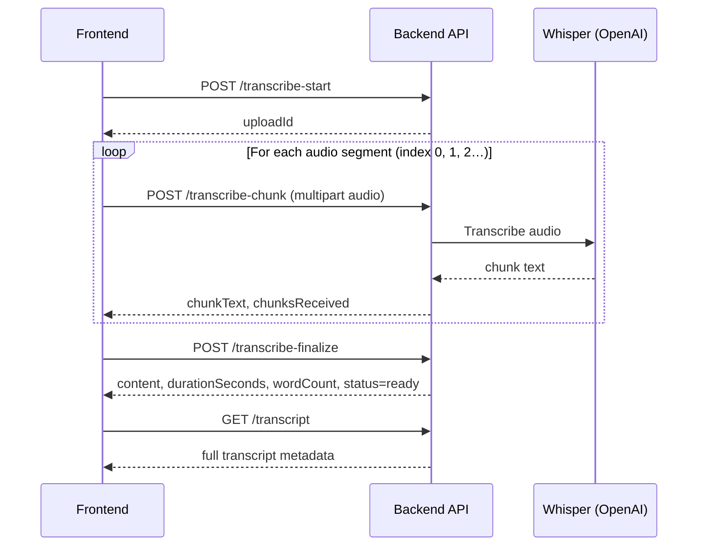

# Session Transcription API — Frontend Integration Guide

**Version:** 2.0 (server-side Whisper transcription)  
**Base path:** `/api/v1/sessions/{sessionId}`  
**Audience:** Frontend / mobile engineers integrating the session recording & transcript feature

---

## 1. Overview

The transcription feature records a therapy session in **time-ordered audio chunks**. The **backend transcribes each chunk** with OpenAI Whisper, stores the text, then **stitches** all chunks into one finalized transcript with timestamps.

### High-level flow



### What changed from the old API (v1)

| Topic | Old API (deprecated) | New API (v2) |
|--------|----------------------|--------------|
| **Start body** | `expectedChunks` required | `expectedChunks` optional (max 5000) |
| **Chunk upload** | JSON: `{ uploadId, chunkIndex, chunkText, silent }` | **Multipart form** with **audio file** |
| **Transcription** | Client sent pre-written text | **Server transcribes audio** |
| **Finalize response** | `finalTranscript`, `status: "completed"` | `content`, `status: "ready"`, `durationSeconds`, `wordCount` |
| **Silent periods** | `silent: true` on chunk JSON | `silentChunks[]` on **finalize** request |
| **Chunk duration** | Not tracked | `chunkDurationSeconds` required per chunk |

> **Do not** send JSON to `/transcribe-chunk`. That causes 400/500 errors. Always use `multipart/form-data` with an audio file.

---

## 2. Authentication & permissions

All endpoints require a **staff JWT** (therapist or admin).

| Endpoint group | Permission |
|----------------|------------|
| Start, chunk, finalize, delete | `SESSION_EDIT` |
| Get transcript, download, smart-fill | `SESSION_VIEW` |

**Headers**

```http
Authorization: Bearer <access_token>
Content-Type: application/json          # start, finalize
Content-Type: multipart/form-data       # transcribe-chunk
```

---

## 3. Transcript statuses

API responses use **lowercase** string values:

| Status | Meaning |
|--------|---------|
| `recording` | Upload started; chunks still accepted |
| `processing` | Finalize in progress |
| `ready` | Final transcript stored (use for smart-fill & display) |
| `failed` | Pipeline failed |
| `expired` | Upload window expired |
| `deleted` | Soft-deleted |

Legacy values (`started`, `uploading`, `completed`, `finalizing`) are accepted on read but new writes use the values above.

---

## 4. API reference

### 4.1 Start upload

Creates a server-owned `uploadId`. Call **once** when the user starts recording.

```http
POST /api/v1/sessions/{sessionId}/transcribe-start
```

**Request body (JSON, optional)**

| Field | Type | Required | Constraints | Description |
|-------|------|----------|-------------|-------------|
| `language` | string | No | See [supported languages](#8-supported-languages) | BCP-47-ish code, e.g. `en-US`, `en-us`, `auto` |
| `translateToEnglish` | boolean | No | — | If `true`, Whisper translates to English |
| `expectedChunks` | integer | No | 1–5000 | Optional planning hint; stored on transcript if sent |
| `retentionDays` | integer | No | 1–90 | Override retention (default 30 days) |

**Example request**

```json
{
  "language": "en-US",
  "translateToEnglish": false,
  "expectedChunks": 5000,
  "retentionDays": 90
}
```

**Response `200 OK`**

| Field | Type | Description |
|-------|------|-------------|
| `uploadId` | string | Server-generated ID, prefix `srv-`. **Store this** for all later calls |

**Example response**

```json
{
  "uploadId": "srv-92f6ecb8de904d98a44144eec584d166"
}
```

---

### 4.2 Upload & transcribe chunk

Uploads **one decodable audio segment**. The server runs Whisper and stores the returned text.

```http
POST /api/v1/sessions/{sessionId}/transcribe-chunk
Content-Type: multipart/form-data
```

**Form fields**

| Field | Type | Required | Description |
|-------|------|----------|-------------|
| `uploadId` | string | **Yes** | From `/transcribe-start` |
| `chunkIndex` | integer | **Yes** | Zero-based, sequential: `0`, `1`, `2`, … Max index: **500** |
| `chunkDurationSeconds` | number | **Yes** | Duration of this audio segment in seconds (used for `durationSeconds` on finalize) |
| `audio` | file | **Yes** | Audio blob; WebM/Opus, MP4, or other `audio/*` (also `video/webm`) |
| `language` | string | No | Per-chunk override; must match start language if upload already has one |

**Limits**

- Max file size: **25 MB** per chunk
- Rate limit (default): **120 requests / 10 minutes** per user per session
- Upload only accepted while transcript status is `recording`

**Example (JavaScript / FormData)**

```javascript
const form = new FormData();
form.append("uploadId", uploadId);
form.append("chunkIndex", String(chunkIndex));
form.append("chunkDurationSeconds", String(durationSeconds));
form.append("audio", audioBlob, "chunk-0.webm");
// optional: form.append("language", "en-US");

await fetch(`/api/v1/sessions/${sessionId}/transcribe-chunk`, {
  method: "POST",
  headers: { Authorization: `Bearer ${token}` },
  body: form,
});
```

**Response `200 OK`**

| Field | Type | Description |
|-------|------|-------------|
| `uploadId` | string | Echo of upload ID |
| `chunkIndex` | integer | Echo of index |
| `chunkText` | string | Transcribed text (may be empty if silent/unintelligible) |
| `chunksReceived` | integer | Total distinct chunks stored so far |

**Example response**

```json
{
  "uploadId": "srv-92f6ecb8de904d98a44144eec584d166",
  "chunkIndex": 0,
  "chunkText": "hello this is the first segment of the session",
  "chunksReceived": 1
}
```

---

### 4.3 Finalize transcript

Stitches all chunks in order, computes duration & word count, marks transcript `ready`.

```http
POST /api/v1/sessions/{sessionId}/transcribe-finalize
Content-Type: application/json
```

**Request body**

| Field | Type | Required | Constraints | Description |
|-------|------|----------|-------------|-------------|
| `uploadId` | string | **Yes** | Must start with `srv-` | Active upload ID |
| `expectedChunks` | integer | **Yes** | 1–5000 | **Actual** number of sequential slots: indices `0 … expectedChunks-1` must each be an uploaded chunk **or** a silent slot |
| `totalChunks` | integer | No | — | Reserved; optional metadata |
| `silentChunks` | array | No | — | Slots with no audio (mic muted, gaps). See below |

**Silent chunk object (`silentChunks[]`)**

| Field | Type | Required | Description |
|-------|------|----------|-------------|
| `index` | integer | **Yes** | Chunk index with no uploaded audio |
| `durationSeconds` | number | **Yes** | How long that silence lasted (≥ 0) |

**Example request**

```json
{
  "uploadId": "srv-92f6ecb8de904d98a44144eec584d166",
  "expectedChunks": 9,
  "silentChunks": [
    { "index": 1, "durationSeconds": 15.0 },
    { "index": 3, "durationSeconds": 20.0 }
  ]
}
```

> **Important:** `expectedChunks` on **finalize** is the **real chunk count** for this recording (e.g. `9`), **not** the planning maximum (`5000`) sent at start.  
> Every index from `0` to `expectedChunks - 1` must be covered by either a successful `/transcribe-chunk` call or an entry in `silentChunks`. Otherwise the API returns **409 Conflict**.

**Response `200 OK`**

| Field | Type | Description |
|-------|------|-------------|
| `id` | long | Transcript record ID |
| `sessionId` | long | Session ID |
| `clientId` | long | Client ID |
| `uploadId` | string | Upload ID |
| `status` | string | `"ready"` when successful |
| `language` | string | Language used |
| `content` | string | Final stitched transcript (timestamped) |
| `durationSeconds` | integer | Total duration across all segments |
| `wordCount` | integer | Word count of final content |

**Example response**

```json
{
  "id": 24,
  "sessionId": 29,
  "clientId": 10,
  "uploadId": "srv-92f6ecb8de904d98a44144eec584d166",
  "status": "ready",
  "language": "en-us",
  "content": "[00:00:00]\nTherapist: hello this is the first segment\n\n[00:00:20]\n[silence ~15s — microphone was muted or no speech]\n\n",
  "durationSeconds": 35,
  "wordCount": 12
}
```

**Final content format**

- Speech: `[HH:MM:SS]\nTherapist: <text>`
- Silence: `[HH:MM:SS]\n[silence ~Ns — microphone was muted or no speech]`
- Unintelligible audio: `[HH:MM:SS]\n[GAP IN RECORDING ~Ns — audio was unintelligible]`

---

### 4.4 Get transcript

Returns the latest transcript for a session.

```http
GET /api/v1/sessions/{sessionId}/transcript
```

**Response `200 OK`**

| Field | Type | Description |
|-------|------|-------------|
| `transcriptId` | long | Transcript ID |
| `sessionId` | long | Session ID |
| `clientId` | long | Client ID |
| `clientName` | string | Client display name |
| `uploadId` | string | Upload ID |
| `status` | string | e.g. `ready`, `recording` |
| `language` | string | Language code |
| `expectedChunks` | integer | Expected chunk count (set at finalize) |
| `receivedChunks` | integer | Chunks received before finalize |
| `finalTranscript` | string | Same as `content` when ready |
| `content` | string | Final transcript text |
| `durationSeconds` | integer | Total seconds (null until finalized) |
| `wordCount` | integer | Word count (null until finalized) |
| `failureReason` | string | Present if failed |
| `startedAt` | ISO-8601 | Upload created |
| `finalizedAt` | ISO-8601 | Finalize timestamp |
| `expiresAt` | ISO-8601 | Retention expiry |
| `updatedAt` | ISO-8601 | Last update |
| `chunks` | array | **Only included while status is NOT `ready`** (in-progress uploads) |

**Chunk object (in-progress only)**

| Field | Type |
|-------|------|
| `chunkIndex` | integer |
| `chunkStatus` | `received` \| `silent` \| `failed` |
| `chunkText` | string |
| `failureReason` | string |
| `receivedAt` | ISO-8601 |

---

### 4.5 Download transcript (plain text)

```http
GET /api/v1/sessions/{sessionId}/transcript/download
```

Returns `text/plain` attachment of finalized transcript body.

---

### 4.6 Delete transcript

```http
DELETE /api/v1/sessions/{sessionId}/transcript
```

**Response:** `204 No Content`

---

### 4.7 Smart-fill session note

Maps finalized transcript into structured note fields via AI. Requires transcript status `ready`.

```http
POST /api/v1/sessions/{sessionId}/transcript/smart-fill
```

**Response `200 OK`**

| Field | Type | Description |
|-------|------|-------------|
| `sessionId` | long | Session ID |
| `uploadId` | string | Upload ID |
| `transcript` | string | Source transcript text |
| `mappedFields` | object | Key-value note field mappings |

---

### 4.8 List transcript statuses (optional)

**All visible transcripts for current user**

```http
GET /api/v1/session-transcripts/status
```

**Per client**

```http
GET /api/v1/clients/{clientId}/session-transcripts/status
```

Returns array of `SessionTranscriptStatusResponse` (summary fields: `transcriptId`, `sessionId`, `status`, `expectedChunks`, `receivedChunks`, timestamps).

---

## 5. Optional: live preview WebSocket

For **real-time preview** while recording (does **not** replace chunk upload):

```
wss://<host>/ws/transcribe-live?uploadId=<id>&language=en&token=<jwt>
```

| Message | Direction | Description |
|---------|-----------|-------------|
| Binary frames | Client → Server | Raw audio (forwarded to Deepgram) |
| `ping` | Client → Server | Keepalive; server replies `pong` |
| `finalize` | Client → Server | Flush live stream |

**Rules**

- `uploadId` must match an active upload in `recording` status
- `language` query param must match the language set at `/transcribe-start` if one was set
- Live preview is **additive** — you must still call `/transcribe-chunk` + `/transcribe-finalize` for the stored transcript

---

## 6. Frontend integration checklist

### Recording session state (recommended)

```typescript
interface TranscriptRecordingState {
  sessionId: number;
  uploadId: string | null;
  chunkIndex: number;           // next index to upload
  chunkDurations: number[];     // seconds per uploaded chunk
  silentSlots: { index: number; durationSeconds: number }[];
  language: string;
}
```

### Step-by-step

1. **Start** — `POST /transcribe-start` → save `uploadId`
2. **While recording** — on each segment boundary:
   - Capture audio blob (recommend **WebM/Opus**)
   - Track segment duration (seconds)
   - `POST /transcribe-chunk` with FormData
   - Increment `chunkIndex`
   - If mic was muted for a slot, do **not** upload audio; record `{ index, durationSeconds }` for finalize
3. **Stop recording** — `POST /transcribe-finalize`:
   - `expectedChunks` = total slots (`uploaded chunks + silent slots`), indices contiguous from `0`
   - Include all `silentChunks`
4. **Display** — `GET /transcript` → show `content`, `durationSeconds`, `wordCount`
5. **Notes** — `POST /transcript/smart-fill` after status is `ready`

### `expectedChunks` — two different uses

| When | Value | Example |
|------|-------|---------|
| **Start** (optional) | Planning ceiling / legacy compat | `5000` |
| **Finalize** (required) | **Actual** slots in this recording | `9` (indices 0–8) |

### Chunk indexing rules

- Start at `0`, increment by `1`, no gaps at finalize time
- Max uploadable index: **500** (501 slots via upload API)
- Re-uploading same `chunkIndex` **overwrites** that chunk

### Error handling

| HTTP | When | Frontend action |
|------|------|-----------------|
| `400` | Validation, bad language, expired upload | Show field errors; restart upload if expired |
| `403` | Not owner / no permission | Block UI |
| `409` | Finalize missing chunks; upload not accepting chunks | Retry missing chunks or adjust `expectedChunks` / `silentChunks` |
| `429` | Chunk rate limit | Back off and retry |
| `503` | Transcription service unavailable | Retry with exponential backoff |

**Common error codes**

| Code | Meaning |
|------|---------|
| `VALIDATION_FAILED` | Bean validation (check `details.errors`) |
| `GENERIC_002` | Bad request / malformed JSON |
| `GENERIC_003` | Unexpected server error |

---

## 7. Complete example (pseudo-code)

```javascript
async function recordSession(sessionId, token) {
  // 1. Start
  const start = await api.post(`/sessions/${sessionId}/transcribe-start`, {
    language: "en-US",
    translateToEnglish: false,
  });
  const uploadId = start.uploadId;

  const silentChunks = [];
  let chunkIndex = 0;

  // 2. Upload each recorded segment
  for (const segment of recordedSegments) {
    if (segment.type === "silent") {
      silentChunks.push({ index: chunkIndex, durationSeconds: segment.duration });
    } else {
      const form = new FormData();
      form.append("uploadId", uploadId);
      form.append("chunkIndex", String(chunkIndex));
      form.append("chunkDurationSeconds", String(segment.duration));
      form.append("audio", segment.blob, `chunk-${chunkIndex}.webm`);
      await api.postForm(`/sessions/${sessionId}/transcribe-chunk`, form);
    }
    chunkIndex++;
  }

  const expectedChunks = chunkIndex;

  // 3. Finalize
  const finalized = await api.post(`/sessions/${sessionId}/transcribe-finalize`, {
    uploadId,
    expectedChunks,
    silentChunks,
  });

  console.log(finalized.durationSeconds, finalized.content);

  // 4. Load full record
  const transcript = await api.get(`/sessions/${sessionId}/transcript`);
  return transcript;
}
```

---

## 8. Supported languages

Default allowlist (configurable server-side):

`auto`, `en`, `en-us`, `en-gb`, `es`, `fr`, `de`, `it`, `pt`, `nl`, `ru`, `hi`, `zh`, `ja`, `ko`, `tr`, `pl`, `ar`, `multi`, `ur`

Use lowercase on the wire (e.g. `en-us`). `auto` lets Whisper detect language.

---

## 9. Migration checklist (old → new frontend)

- [ ] Replace JSON `/transcribe-chunk` with **multipart** upload including **audio file**
- [ ] Remove client-side `chunkText` and `silent` fields from chunk requests
- [ ] Add `chunkDurationSeconds` to every chunk upload
- [ ] Move silent period handling to `silentChunks` on **finalize**
- [ ] Send **real** chunk count on finalize, not `5000`
- [ ] Read `content` and `status: "ready"` from finalize response (not `finalTranscript` / `completed`)
- [ ] Display `durationSeconds` and `wordCount` from GET/finalize responses
- [ ] Call smart-fill only when `status === "ready"`

---

## 10. Related configuration (ops reference)

| Setting | Default | Description |
|---------|---------|-------------|
| `app.transcripts.retention-days` | 30 | Upload expiry |
| `app.transcripts.max-expected-chunks` | 5000 | Max `expectedChunks` value |
| `app.transcripts.max-chunk-chars` | 40000 | Truncation per chunk text |
| `app.transcripts.chunk-rate-limit.max-requests` | 120 | Per user/session window |
| `app.transcripts.chunk-rate-limit.window-seconds` | 600 | Rate limit window |

---

*Document generated for SmartHub / TherapyFlow session transcription module. Update this file when API contracts change.*
