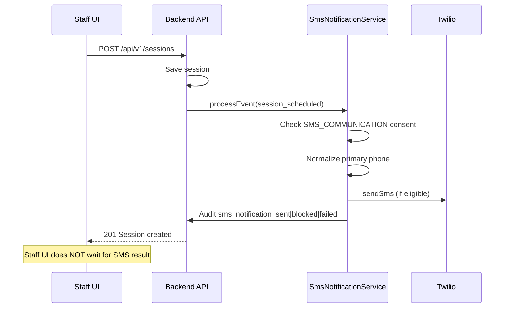
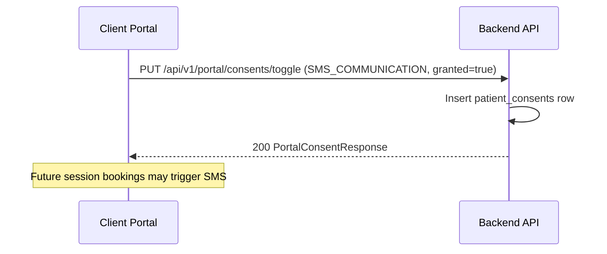
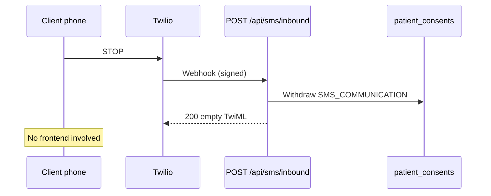

# Twilio SMS — Frontend Integration Guide

> **Audience:** Frontend engineers integrating the staff app and client portal with the SmartHub Twilio SMS backend (Java/Spring Boot).
>
> **Backend reference:** See [`twilio-sms-rebuild.md`](./twilio-sms-rebuild.md) for full backend architecture and HIPAA rules.

---

## 1. The most important rule

**The frontend never sends SMS directly.**

There is **no** public API like `POST /api/sms/send`. Outbound texts are triggered **server-side** when appointment events occur (session created, rescheduled, cancelled, recurring series booked, 24h reminder).

```
┌─────────────────────────────────────────────────────────────────┐
│  Frontend                                                        │
│    • Manage SMS consent                                          │
│    • Ensure client has a primary phone                           │
│    • Schedule/update sessions (existing APIs)                    │
│    • View SMS delivery history (staff only)                      │
│    ✗  Does NOT call Twilio or a "send SMS" endpoint             │
└───────────────────────────┬─────────────────────────────────────┘
                            │
┌───────────────────────────▼─────────────────────────────────────┐
│  Backend (automatic)                                               │
│    Session create/reschedule/cancel/reminder                     │
│      → NotificationService.processEvent(...)                     │
│      → SmsNotificationService (consent + phone + Twilio)         │
└─────────────────────────────────────────────────────────────────┘
```

**What this means for frontend work:**

| Action | Frontend calls API? |
|--------|---------------------|
| Send appointment confirmation SMS | **No** — happens when staff books a session |
| Send reschedule/cancel SMS | **No** — happens on session update/cancel |
| Send 24h reminder SMS | **No** — backend scheduled job |
| Grant/withdraw SMS consent | **Yes** |
| Set client primary phone | **Yes** (existing contacts API) |
| View SMS delivery log | **Yes** (staff only) |
| Inbound STOP/START from client phone | **No** — Twilio webhook only |

---

## 2. Feature overview (what users get)

### Client receives SMS when:
- A **single session** is scheduled (`session_scheduled`)
- A **recurring series** is booked — **one combined** confirmation (`session_series_scheduled`)
- A session is **rescheduled** (`session_rescheduled`)
- A session is **cancelled** (`session_cancelled`)
- A **24-hour reminder** fires (`session_reminder`)

### SMS is only sent if:
1. Twilio is configured on the server (`TWILIO_ACCOUNT_SID`, `TWILIO_AUTH_TOKEN`, `TWILIO_FROM_NUMBER`)
2. Client has **current** `SMS_COMMUNICATION` consent in `patient_consents` (audit label: `sms_notifications`)
3. Client has a **primary phone** contact that normalizes to valid E.164

If any check fails, **no SMS is sent** — but the attempt is still **audited** (blocked/skipped/failed).

### Message content (HIPAA-safe)
Messages contain **only**:
- Practice name (e.g. "SmartHub")
- Appointment date/time
- `Reply STOP to opt out.`

They **never** include client name, therapist name, service, room, Zoom link, or clinical details.

### Client opt-out / opt-in
- Client texts **STOP** (or CANCEL, UNSUBSCRIBE, etc.) → backend withdraws consent via Twilio webhook
- Client texts **START** (or YES, UNSTOP) → backend grants consent
- Frontend does **not** handle inbound SMS; optional UI can reflect consent state after refresh

---

## 3. Prerequisites checklist (before SMS will work)

Use this checklist in onboarding / client profile UI:

| # | Requirement | Who sets it | API / UI |
|---|-------------|-------------|----------|
| 1 | Primary phone on client record | Staff or client | `POST/PUT /api/v1/clients/{id}/contacts` |
| 2 | SMS consent granted | Client (portal) or staff | Portal toggle or staff consent API |
| 3 | Twilio configured on server | DevOps | Env vars (not frontend) |
| 4 | Session booked/updated | Staff | Existing session APIs |

**Optional UX:** Show a banner on client profile when phone or consent is missing: *"SMS reminders disabled — add phone and enable SMS consent."*

---

## 4. APIs the frontend **does** use

### 4.1 Client portal — SMS consent (client self-service)

**Base path:** `/api/v1/portal`  
**Auth:** Client JWT (`CLIENT` role)

#### List current consents
```http
GET /api/v1/portal/consents
Authorization: Bearer <client_token>
```

#### Toggle SMS consent (recommended for toggle UI)
```http
PUT /api/v1/portal/consents/toggle
Authorization: Bearer <client_token>
Content-Type: application/json

{
  "consentType": "SMS_COMMUNICATION",
  "granted": true,
  "consentVersion": "1.0"
}
```

To withdraw:
```json
{
  "consentType": "SMS_COMMUNICATION",
  "granted": false,
  "consentVersion": "1.0"
}
```

#### Alternative: explicit grant / withdraw
```http
POST /api/v1/portal/consents
Content-Type: application/json

{
  "consentType": "SMS Communication",
  "granted": true,
  "consentVersion": "1.0"
}
```

```http
POST /api/v1/portal/consents/withdraw
Content-Type: application/json

{
  "consentType": "SMS Communication"
}
```

> **Note:** `toggle` uses enum `SMS_COMMUNICATION`. `grant`/`withdraw` use display name `"SMS Communication"`. Both write to the same `patient_consents` ledger the SMS service reads.

**Suggested portal UI:**
- Settings → Notifications → **"Receive appointment SMS"** toggle
- Link to SMS consent document (version `1.0`)
- Short copy: *"We'll text appointment confirmations and reminders. Reply STOP to opt out. Messages do not include clinical details."*

---

### 4.2 Staff app — record SMS consent for a client

**Base path:** `/api/v1/admin/consents`  
**Auth:** Therapist / Admin / Supervisor JWT

```http
POST /api/v1/admin/consents/clients/{clientId}
Authorization: Bearer <staff_token>
Content-Type: application/json

{
  "consentType": "SMS_COMMUNICATION",
  "granted": true,
  "consentVersion": "1.0",
  "source": "signed_consent_form",
  "notes": "Client signed SMS consent in office"
}
```

Withdraw:
```json
{
  "consentType": "SMS_COMMUNICATION",
  "granted": false,
  "consentVersion": "1.0",
  "source": "signed_consent_form",
  "notes": "Client requested to stop SMS"
}
```

**Suggested staff UI (Consent Panel):**
- Toggle or checkbox: **SMS notifications**
- Show consent version, granted date, source
- Read-only indicator if consent withdrawn

---

### 4.3 Staff app — client primary phone

SMS uses `Client.getPrimaryPhone()` from `client_contacts`. Ensure a **primary** `PHONE` (or `WORK_PHONE`) contact exists.

```http
GET /api/v1/clients/{clientId}/contacts
Authorization: Bearer <staff_token>
```

```http
POST /api/v1/clients/{clientId}/contacts
Authorization: Bearer <staff_token>
Content-Type: application/json

{
  "contactType": "PHONE",
  "contactValue": "5195551234",
  "isPrimary": true,
  "label": "Mobile"
}
```

**Frontend tips:**
- Validate phone format in UI (10-digit US or E.164) — backend normalizes at send time
- Mark one phone as `isPrimary: true`
- Show normalized preview if desired: `(519) 555-1234` → sent as `+15195551234`

---

### 4.4 Staff app — SMS delivery history

**Auth:** `CLIENT_VIEW_OWN` | `CLIENT_VIEW_TEAM` | `CLIENT_VIEW_ALL`

#### Paginated log
```http
GET /api/v1/clients/{clientId}/sms-log?page=1&pageSize=25
Authorization: Bearer <staff_token>
```

Optional date filters:
```http
GET /api/v1/clients/{clientId}/sms-log?from=2026-01-01T00:00:00Z&to=2026-12-31T23:59:59Z&page=1&pageSize=25
```

**Response shape:**
```json
{
  "items": [
    {
      "id": 1001,
      "action": "sms_notification_sent",
      "result": "success",
      "resourceId": "99",
      "timestamp": "2026-06-15T14:00:00Z",
      "details": "{\"messageSid\":\"SMxxx\",\"eventType\":\"session_scheduled\"}"
    }
  ],
  "totalCount": 1,
  "page": 1,
  "pageSize": 25,
  "totalPages": 1
}
```

#### CSV export
```http
GET /api/v1/clients/{clientId}/sms-log/export?from=...&to=...
Authorization: Bearer <staff_token>
```

Returns file: `sms-log-client-{clientId}-{date}.csv`

**Suggested staff UI (SMS History tab on client profile):**

| Column | Source |
|--------|--------|
| Date/time | `timestamp` |
| Outcome | Map `action` + `result` (see §6) |
| Event | Parse `details.eventType` |
| Twilio SID | Parse `details.messageSid` (sent only) |
| Reason | Parse `details.error` or `details.reason` (failed/blocked) |

**Do not** display raw `details` if it could ever contain PHI (current implementation is PHI-free).

---

### 4.5 Session APIs — triggers SMS automatically

Frontend continues using **existing** scheduling APIs. No SMS-specific parameters.

| User action | API (existing) | Backend SMS event |
|-------------|----------------|-------------------|
| Book single session | `POST /api/v1/sessions` | `session_scheduled` |
| Book recurring series | Recurring session create API | `session_series_scheduled` |
| Reschedule session | `PUT /api/v1/sessions/{id}` | `session_rescheduled` |
| Cancel session | Cancel/delete session API | `session_cancelled` |
| (Automatic) 24h reminder | — | `session_reminder` |

**Frontend does not:**
- Pass `sendSms: true`
- Call a separate notification endpoint after booking

**Optional UX after booking:** Toast like *"Client will receive SMS confirmation if SMS consent and phone are on file"* — based on client profile state, not on SMS API response (send is async).

---

## 5. APIs the frontend **does not** use

| Endpoint | Called by | Frontend role |
|----------|-----------|---------------|
| `POST /api/sms/inbound` | Twilio webhook | None — configure in Twilio Console |
| Internal `SmsNotificationService` | Backend only | None |
| `TwilioSmsService.sendSms()` | Backend only | None |

---

## 6. Audit actions & error codes (for SMS History UI)

### Delivery outcomes (`resourceType = sms_notification`)

| `action` | Meaning | Show in UI as |
|----------|---------|---------------|
| `sms_notification_sent` | Twilio accepted message | **Sent** |
| `sms_notification_blocked` | Consent/phone/client missing | **Blocked** |
| `sms_notification_failed` | Twilio/provider error | **Failed** |
| `sms_notification_skipped` | Twilio not configured / unsupported event | **Skipped** |

### Common `details` fields (JSON string)

| Field | Example | When |
|-------|---------|------|
| `messageSid` | `SM123...` | Sent |
| `eventType` | `session_scheduled` | All |
| `reason` | `missing_or_withdrawn_consent` | Blocked |
| `reason` | `missing_or_invalid_phone` | Blocked |
| `reason` | `sms_not_configured` | Skipped |
| `error` | Human-readable message | Failed |
| `errorCode` | `AUTHENTICATION_FAILED` | Failed |

### `errorCode` values (staff troubleshooting)

| `errorCode` | Meaning | Staff-facing hint |
|-------------|---------|-------------------|
| `NOT_CONFIGURED` | Server missing Twilio env | Contact administrator |
| `INVALID_CONFIGURATION` | Bad SID/token/from number on server | Contact administrator |
| `AUTHENTICATION_FAILED` | Invalid Twilio credentials | Contact administrator |
| `INSUFFICIENT_CREDITS` | Twilio balance too low | Contact administrator |
| `ACCOUNT_SUSPENDED` | Twilio account inactive | Contact administrator |
| `INVALID_DESTINATION` | Bad/unverified phone number | Verify client phone |
| `PROVIDER_ERROR` | Other Twilio error | Retry or contact support |

### Consent changes from inbound STOP/START (`resourceType = patient_consent`)

| `action` | Meaning |
|----------|---------|
| `consent_granted` | Client texted START/YES |
| `consent_withdrawn` | Client texted STOP |

Refresh consent UI after client may have opted out via text.

---

## 7. Recommended frontend screens

### 7.1 Client portal

```
Settings / Privacy & Notifications
├── [Toggle] Email notifications        (existing)
├── [Toggle] SMS appointment texts      → PUT /api/v1/portal/consents/toggle
│     └── Link: SMS consent document v1.0
└── Help text: "Reply STOP to any message to opt out"
```

**No** "Send test SMS" button.

### 7.2 Staff — client profile

```
Client Profile
├── Contacts tab
│     └── Primary phone (required for SMS)
├── Consent panel
│     └── SMS Communication toggle      → POST /api/v1/admin/consents/clients/{id}
├── SMS History tab (new)
│     ├── Table from GET .../sms-log
│     ├── Filters: date range
│     └── Export CSV button             → GET .../sms-log/export
└── Scheduling (existing)
      └── Booking session triggers SMS automatically
```

### 7.3 Staff — scheduling (existing flows)

No API changes. Optional indicators:
- Icon on client picker if SMS ready (consent ✓ + phone ✓)
- Post-booking notice about SMS eligibility

---

## 8. End-to-end flows (sequence)

### Flow A: Staff books session → client gets SMS



### Flow B: Client enables SMS in portal



### Flow C: Client texts STOP



---

## 9. State model for frontend

Derive **"SMS eligible"** in UI (client-side helper, not a backend enum):

```typescript
type SmsEligibility = {
  eligible: boolean;
  reasons: string[];
};

function getSmsEligibility(client: {
  hasSmsConsent: boolean;
  primaryPhone: string | null;
}): SmsEligibility {
  const reasons: string[] = [];
  if (!client.hasSmsConsent) reasons.push("SMS consent not granted");
  if (!client.primaryPhone) reasons.push("No primary phone");
  return { eligible: reasons.length === 0, reasons };
}
```

**`hasSmsConsent`:** From consent list — latest `SMS_COMMUNICATION` with `granted: true` and `withdrawnAt: null`. Use `GET /api/v1/portal/consents` (portal) or staff consent query endpoints.

---

## 10. Environment & Twilio setup (not frontend, but affects UX)

Backend requires (server env):
```
TWILIO_ACCOUNT_SID=ACxxxxxxxxxxxxxxxxxxxxxxxxxxxxxxxx
TWILIO_AUTH_TOKEN=xxxxxxxxxxxxxxxxxxxxxxxxxxxxxxxx
TWILIO_FROM_NUMBER=+1XXXXXXXXXX
```

Twilio Console:
- Inbound webhook: `https://<your-domain>/api/sms/inbound`
- Trial accounts: recipient numbers must be verified in Twilio

If Twilio is missing or misconfigured, staff SMS History will show `sms_notification_skipped` or `sms_notification_failed` with `errorCode` — not a frontend bug.

---

## 11. Testing from frontend perspective

| Test | Steps | Expected |
|------|-------|----------|
| Consent gate | Book session without SMS consent | SMS History: `sms_notification_blocked`, reason `missing_or_withdrawn_consent` |
| Happy path | Grant consent + primary phone + book session | SMS History: `sms_notification_sent` + `messageSid` |
| No phone | Consent yes, no phone | Blocked: `missing_or_invalid_phone` |
| Portal toggle | Toggle SMS on/off | Consent API 200; subsequent bookings respect state |
| STOP | Client texts STOP to Twilio number | Consent withdrawn; next booking blocked |
| Export | Click export on SMS History | CSV downloads |

---

## 12. FAQ

**Q: Do we need to call an API after creating a session to send SMS?**  
**A: No.** Session create already triggers the notification pipeline.

**Q: Can the client portal send a test SMS?**  
**A: No.** There is no send endpoint by design (HIPAA + TCPA).

**Q: Does the frontend talk to Twilio?**  
**A: No.** Only the backend does. Frontend talks to SmartHub REST APIs.

**Q: What consent type string should we use?**  
**A:** Portal toggle: `SMS_COMMUNICATION` (enum). Staff API: `SMS_COMMUNICATION` (enum in JSON). Portal grant/withdraw: `"SMS Communication"` (display name).

**Q: Should we show SMS message body in the UI?**  
**A: No.** Bodies are not stored in a user-facing API. SMS History shows delivery metadata only.

**Q: How do we know if SMS is enabled for the practice?**  
**A: There is no public status endpoint yet.** Infer from SMS History (`sms_not_configured` skips) or admin/DevOps confirmation of env vars.

---

## 13. Related backend files

| Area | Location |
|------|----------|
| SMS send + errors | `notification/service/TwilioSmsService.java` |
| Consent gating + audit | `notification/service/SmsNotificationService.java` |
| Inbound webhook | `notification/controller/TwilioInboundSmsController.java` |
| SMS log API | `client/controller/ClientController.java` (`/sms-log`) |
| Portal consent | `client/portal/controller/ClientPortalController.java` |
| Staff consent | `client/controller/PatientConsentController.java` |
| Backend rebuild doc | `docs/twilio-sms-rebuild.md` |

---

## 14. Summary for frontend leads

1. **Do not build a "Send SMS" feature** — build **consent**, **phone**, and **history** UI.
2. **Keep using existing session/scheduling APIs** — SMS is a side effect.
3. **Integrate 3 API groups:** portal consent toggle, staff consent + contacts, staff SMS log.
4. **Inbound STOP/START** is Twilio-only — refresh consent state when viewing client profile.
5. **SMS History** is the staff debugging/support surface for delivery outcomes and `errorCode`.
